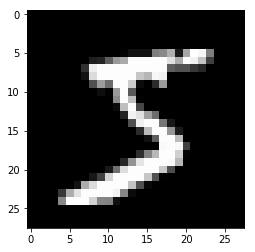
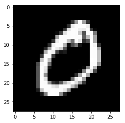
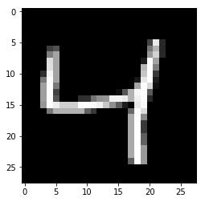
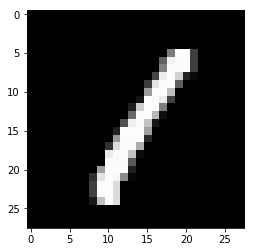
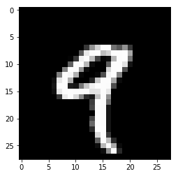
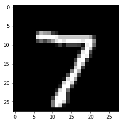
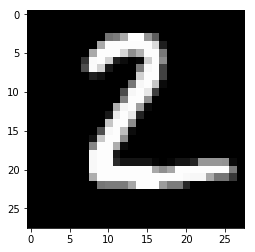

# Lab assignment: classifying digits with Deep Networks


In this assignment we will face the problem of recognizing handwritten digits. We will see how in order to achieve maximum effectiveness we will need to resort to several Deep Learning techniques.

## Guidelines

Throughout this notebook you will find empty cells that you will need to fill with your own code. Follow the instructions in the notebook and pay special attention to the following symbols.

<table>
 <tr><td></td><td>You will need to solve a question by writing your own code or answer in the cell immediately below, or in a different file as instructed.</td></tr>
 <tr><td></td><td>This is a hint or useful observation that can help you solve this assignment. You are not expected to write any solution, but you should pay attention to them to understand the assignment.</td></tr>
 <tr><td></td><td>This is an advanced and voluntary exercise that can help you gain a deeper knowledge into the topic. Good luck!</td></tr>
</table>

During the assigment you will make use of several Python packages that might not be installed in your machine. If that is the case, you can install new Python packages with

    conda install PACKAGENAME
    
if you are using Python Anaconda. Else you should use

    pip install PACKAGENAME

You will need the following packages for this particular assignment. Make sure they are available before proceeding:

* **numpy**
* **keras**
* **matplotlib**

The following code will embed any plots into the notebook instead of generating a new window:


```python
import matplotlib.pyplot as plt
%matplotlib inline
```

Lastly, if you need any help on the usage of a Python function you can place the writing cursor over its name and press Caps+Shift to produce a pop-out with related documentation. This will only work inside code cells. 

Let's go!

## The Keras library

In this lab we will make use of the <a href=http://keras.io/>keras</a> Deep Learning library for Python. This library allows building several kinds of shallow and deep networks, following either a sequential or a graph architecture.

## Data loading

The handwritten digits recognition problem we will face is already included as a testbed in keras. Loading it only requires invoking


```python
from keras.datasets import mnist
(X_train, y_train), (X_test, y_test) = mnist.load_data()
```

    C:\Users\raul_\Anaconda3\lib\site-packages\h5py\__init__.py:36: FutureWarning: Conversion of the second argument of issubdtype from `float` to `np.floating` is deprecated. In future, it will be treated as `np.float64 == np.dtype(float).type`.
      from ._conv import register_converters as _register_converters
    Using TensorFlow backend.
    

    Downloading data from https://s3.amazonaws.com/img-datasets/mnist.npz
    11493376/11490434 [==============================] - 7s 1us/step
    

The loaded **X** variables are made up of the handwritten digits to classify, while the **y** variables contain the labels of the corresponding X images, telling the digits such images represent. We will use the **train** data to build our neural network, while we will use the **test** data to measure the performance of such network on an independent dataset.

We can check how many images we have for training and testing as follows:


```python
len(X_train)
```


    60000


```python
len(X_test)
```


    10000


Also we can take a look at the shape, width and height in pixels, of an image:


```python
X_test[0].shape
```


    (28, 28)


We can also visualize the images we are working with by means of using the matplotlib library. Here we are taking the first training image and painting it with a grayscale colormap. Also we are printing the corresponding class value, to ensure the labeling of the digit is correct.


```python
plt.imshow(X_train[0], 'gray')
print("Digit class:", y_train[0])
```

    Digit class: 5
    





<table>
 <tr><td></td><td>
Use the cell below to plot some other image in the training dataset, along with its corresponding digit class number. Can you find any hard to identify digit?
 </td></tr>
</table>


```python
plt.imshow(X_train[1], 'gray')
print("Digit class:", y_train[1])
```

    Digit class: 0
    





```python
plt.imshow(X_train[2], 'gray')
print("Digit class:", y_train[2])
```

    Digit class: 4
    





```python
plt.imshow(X_train[3], 'gray')
print("Digit class:", y_train[3])
```

    Digit class: 1
    





```python
plt.imshow(X_train[4], 'gray')
print("Digit class:", y_train[4])
```

    Digit class: 9
    





Before starting building networks we should always normalize our data. This usually means substracting the mean from each variable and then dividing by the standard deviation. However in grayscale images like the ones we are working with all variables represent pixel intensities, and are bound to integers in the range [0, 255]. We can thus perform a simple initialization by just compressing this range to [0, 1]. We should also transform the data to real numbers (float) while performing this operation:


```python
X_train = X_train.astype('float32') / 255
```

<table>
 <tr><td></td><td>
Perform the same normalization for the test data
 </td></tr>
</table>


```python
X_test = X_test.astype('float32') / 255
```

As for the outputs, normalization as such is not required, but we should change the class encoding to something more akin to neural networks. Instead of having a single integer ranging [0,9] to encode the different classes, we will use a <a href=https://en.wikipedia.org/wiki/One-hot>one-hot vector encoding</a>


```python
from keras.utils import np_utils
Y_train = np_utils.to_categorical(y_train, 10) # We have 10 classes to codify
```

Let's check that the transformation was correct:


```python
Y_train
```


    array([[0., 0., 0., ..., 0., 0., 0.],
           [1., 0., 0., ..., 0., 0., 0.],
           [0., 0., 0., ..., 0., 0., 0.],
           ...,
           [0., 0., 0., ..., 0., 0., 0.],
           [0., 0., 0., ..., 0., 0., 0.],
           [0., 0., 0., ..., 0., 1., 0.]])


<table>
 <tr><td></td><td>
Repeat the same encoding for the classes of the test data
 </td></tr>
</table>


```python
Y_test = np_utils.to_categorical(y_test, 10) # We have 10 classes to codify
```


```python
Y_test
```


    array([[0., 0., 0., ..., 1., 0., 0.],
           [0., 0., 1., ..., 0., 0., 0.],
           [0., 1., 0., ..., 0., 0., 0.],
           ...,
           [0., 0., 0., ..., 0., 0., 0.],
           [0., 0., 0., ..., 0., 0., 0.],
           [0., 0., 0., ..., 0., 0., 0.]])


## Perceptron network

Let's start trying to solve the problem with the simplest neural network: a Perceptron. This means a neural network with no hidden layers, just some weights going from input to output.

### Defining the network

Building a network in Keras begins by choosing the type of architecture. We can either decide to build a **Sequential** network, where each layer is followed by another one in a chain, or a **Graph** network, where divergences and loops of layers can take place. In this practice we will restrict ourselves to the Sequential architecture. We can initialize a Sequential network with


```python
from keras.models import Sequential
model = Sequential()
```

Once the network has been initialized this way, we just need to iteratively add the desired layers. For the perceptron network we only require a "classic" layer of weights from input to output. Such layer is name **Dense** in Keras.


```python
from keras.layers.core import Dense
```

Usually creating a dense layer only involves specifying the number of outputs units of such layer. But since this will be the first layer in the network we also need to specify the number of inputs. Our inputs are images of 28x28 pixels, which makes 784 input values. As for the outputs, we have 10 classes in our problem, so that makes 10 output units.


```python
denselayer = Dense(10, input_shape=(784,))
```

Now we add the layer to network


```python
model.add(denselayer)
```

With this we have declared the layer of weights from inputs to outputs. Since we are facing a classification problem we should also add an activation function to the output units that enforces the output values to the range [0,1]. We will choose a softmax activation for doing so:


```python
from keras.layers.core import Activation
model.add(Activation('softmax'))
```

With this the definition of our network is completed. We can get a text description of the network by calling


```python
model.summary()
```

    _________________________________________________________________
    Layer (type)                 Output Shape              Param #   
    =================================================================
    dense_1 (Dense)              (None, 10)                7850      
    _________________________________________________________________
    activation_1 (Activation)    (None, 10)                0         
    =================================================================
    Total params: 7,850
    Trainable params: 7,850
    Non-trainable params: 0
    _________________________________________________________________
    

### Compiling the network

After defining the network architecture the next step involves compiling the network. Compilation is an automatic process that transforms the network definition into an equivalent symbolic formulation for which derivatives can be computed, thus allowing learning through backpropagation. The only input required in this process is choosing the loss function the network should minimize, and the optimizer used for learning.

For our current network we will use **categorical crossentropy** as the loss function, as it is suitable for multiclass classification problems. As for the optimizer, we will use **Stochastic Gradient Descent**. We will also include the **classification accuracy** as a metric to measure the performance of our model.


```python
model.compile(loss='categorical_crossentropy', optimizer='sgd', metrics=['accuracy'])
```

### Training the network

We are now almost ready to adjust the network parameters through training over our data. There is only one small detail left: our data is in the form of bidimensional images, while a perceptron only understands training patterns as one-dimensional vectors of data. We should then transform the data to vector form to input it into the network, something we can do with the **reshape** method of the data:


```python
trainvectors = X_train.reshape(60000, 784)
```

We can check now that our training data has become a matrix of 60000 training patterns (rows) and 784 variables (pixels) per pattern:


```python
trainvectors.shape
```


    (60000, 784)


<table>
 <tr><td></td><td>
Perform a similar transformation for the X_test data, saving the reshaped data into a variable named *testvectors*. Note that the number of pattens in the test data is different from the number of patterns in the training data.
 </td></tr>
</table>


```python
testvectors = X_test.reshape(10000, 784)
```

Now we can invoke the **fit** method of the network, which will perform the training process. It is done as follows


```python
model.fit(
    trainvectors, # Training data
    Y_train, # Labels of training data
    batch_size=128, # Batch size for the optimizer algorithm
    nb_epoch=20, # Number of epochs to run the optimizer algorithm
    verbose=2 # Level of verbosity of the log messages
)
```

    C:\Users\raul_\Anaconda3\lib\site-packages\keras\models.py:942: UserWarning: The `nb_epoch` argument in `fit` has been renamed `epochs`.
      warnings.warn('The `nb_epoch` argument in `fit` '
    

    Epoch 1/20
     - 1s - loss: 1.2881 - acc: 0.6897
    Epoch 2/20
     - 1s - loss: 0.7156 - acc: 0.8406
    Epoch 3/20
     - 1s - loss: 0.5869 - acc: 0.8598
    Epoch 4/20
     - 1s - loss: 0.5253 - acc: 0.8695
    Epoch 5/20
     - 1s - loss: 0.4878 - acc: 0.8753
    Epoch 6/20
     - 1s - loss: 0.4621 - acc: 0.8796
    Epoch 7/20
     - 1s - loss: 0.4429 - acc: 0.8836
    Epoch 8/20
     - 1s - loss: 0.4280 - acc: 0.8867
    Epoch 9/20
     - 1s - loss: 0.4160 - acc: 0.8891
    Epoch 10/20
     - 1s - loss: 0.4060 - acc: 0.8908
    Epoch 11/20
     - 1s - loss: 0.3975 - acc: 0.8931
    Epoch 12/20
     - 1s - loss: 0.3902 - acc: 0.8942
    Epoch 13/20
     - 1s - loss: 0.3838 - acc: 0.8959
    Epoch 14/20
     - 1s - loss: 0.3782 - acc: 0.8971
    Epoch 15/20
     - 1s - loss: 0.3731 - acc: 0.8981
    Epoch 16/20
     - 1s - loss: 0.3686 - acc: 0.8992
    Epoch 17/20
     - 1s - loss: 0.3645 - acc: 0.8999
    Epoch 18/20
     - 1s - loss: 0.3608 - acc: 0.9010
    Epoch 19/20
     - 1s - loss: 0.3574 - acc: 0.9017
    Epoch 20/20
     - 1s - loss: 0.3542 - acc: 0.9025
    


    <keras.callbacks.History at 0x1cd6f733fd0>


Now that our neural network model is trained, we can obtain class predictions for the test set as follows:


```python
preds = model.predict_classes(testvectors)
```

So for instance, the first image in the test set and its predicted class are


```python
plt.imshow(X_test[0], 'gray')
print("Real class", y_test[0], "predicted class", preds[0])
```

    Real class 7 predicted class 7
    





<table>
 <tr><td></td><td>
Compare the predicted and real classes for other images in the test set. Can you find any error?
 </td></tr>
</table>


```python
plt.imshow(X_test[1], 'gray')
print("Real class", y_test[1], "predicted class", preds[1])
```

    Real class 2 predicted class 2
    





<table>
 <tr><td></td><td>
You can spot all the errors in an automated way by comparing *y_test* against *preds* and getting the indexes of the mismatching elements. The function <a href=http://docs.scipy.org/doc/numpy-1.10.1/reference/generated/numpy.where.html>np.where</a> might also help.
 </td></tr>
</table>


```python
error=0
for i in range(len(y_test)):
    if y_test[i] != preds[i]:
        print("error finded: predict(",y_test[i],")different to(",preds[i],")")
        error=error+1
print(str(error) + " errors finded")
```

    error finded: predict( 5 )different to( 6 )
    error finded: predict( 4 )different to( 6 )
    error finded: predict( 1 )different to( 3 )
    error finded: predict( 3 )different to( 2 )
    error finded: predict( 2 )different to( 7 )
    error finded: predict( 7 )different to( 9 )
    error finded: predict( 7 )different to( 1 )
    error finded: predict( 7 )different to( 4 )
    error finded: predict( 2 )different to( 9 )
    error finded: predict( 9 )different to( 3 )
    error finded: predict( 6 )different to( 5 )
    error finded: predict( 8 )different to( 7 )
    error finded: predict( 9 )different to( 8 )
    error finded: predict( 7 )different to( 4 )
    error finded: predict( 3 )different to( 6 )
    error finded: predict( 4 )different to( 2 )
    error finded: predict( 6 )different to( 0 )
    error finded: predict( 8 )different to( 4 )
    error finded: predict( 4 )different to( 1 )
    error finded: predict( 7 )different to( 9 )
    error finded: predict( 3 )different to( 5 )
    error finded: predict( 2 )different to( 3 )
    error finded: predict( 9 )different to( 1 )
    error finded: predict( 2 )different to( 7 )
    error finded: predict( 5 )different to( 3 )
    error finded: predict( 6 )different to( 4 )
    error finded: predict( 3 )different to( 7 )
    error finded: predict( 5 )different to( 0 )
    error finded: predict( 2 )different to( 7 )
    error finded: predict( 3 )different to( 7 )
    error finded: predict( 8 )different to( 9 )
    error finded: predict( 8 )different to( 7 )
    error finded: predict( 2 )different to( 8 )
    error finded: predict( 6 )different to( 0 )
    error finded: predict( 9 )different to( 8 )
    error finded: predict( 3 )different to( 5 )
    error finded: predict( 6 )different to( 5 )
    error finded: predict( 3 )different to( 7 )
    error finded: predict( 7 )different to( 9 )
    error finded: predict( 5 )different to( 8 )
    error finded: predict( 9 )different to( 3 )
    error finded: predict( 8 )different to( 2 )
    error finded: predict( 5 )different to( 3 )
    error finded: predict( 3 )different to( 5 )
    error finded: predict( 4 )different to( 8 )
    error finded: predict( 3 )different to( 8 )
    error finded: predict( 3 )different to( 5 )
    error finded: predict( 3 )different to( 6 )
    error finded: predict( 2 )different to( 1 )
    error finded: predict( 8 )different to( 3 )
    error finded: predict( 7 )different to( 9 )
    error finded: predict( 7 )different to( 1 )
    error finded: predict( 8 )different to( 6 )
    error finded: predict( 4 )different to( 9 )
    error finded: predict( 3 )different to( 5 )
    error finded: predict( 3 )different to( 8 )
    error finded: predict( 8 )different to( 2 )
    error finded: predict( 8 )different to( 3 )
    error finded: predict( 7 )different to( 9 )
    error finded: predict( 4 )different to( 6 )
    error finded: predict( 2 )different to( 8 )
    error finded: predict( 1 )different to( 8 )
    error finded: predict( 2 )different to( 1 )
    error finded: predict( 9 )different to( 4 )
    error finded: predict( 3 )different to( 9 )
    error finded: predict( 2 )different to( 6 )
    error finded: predict( 5 )different to( 7 )
    error finded: predict( 7 )different to( 4 )
    error finded: predict( 2 )different to( 9 )
    error finded: predict( 7 )different to( 1 )
    error finded: predict( 7 )different to( 2 )
    error finded: predict( 8 )different to( 4 )
    error finded: predict( 4 )different to( 9 )
    error finded: predict( 0 )different to( 6 )
    error finded: predict( 5 )different to( 8 )
    error finded: predict( 2 )different to( 8 )
    error finded: predict( 2 )different to( 8 )
    error finded: predict( 4 )different to( 9 )
    error finded: predict( 2 )different to( 8 )
    error finded: predict( 4 )different to( 9 )
    error finded: predict( 5 )different to( 9 )
    error finded: predict( 8 )different to( 5 )
    error finded: predict( 8 )different to( 3 )
    error finded: predict( 8 )different to( 7 )
    error finded: predict( 5 )different to( 3 )
    error finded: predict( 8 )different to( 2 )
    error finded: predict( 4 )different to( 9 )
    error finded: predict( 9 )different to( 7 )
    error finded: predict( 7 )different to( 8 )
    error finded: predict( 2 )different to( 7 )
    error finded: predict( 3 )different to( 5 )
    error finded: predict( 2 )different to( 0 )
    error finded: predict( 3 )different to( 5 )
    error finded: predict( 8 )different to( 9 )
    error finded: predict( 7 )different to( 2 )
    error finded: predict( 1 )different to( 6 )
    error finded: predict( 4 )different to( 9 )
    error finded: predict( 6 )different to( 0 )
    error finded: predict( 2 )different to( 3 )
    error finded: predict( 3 )different to( 8 )
    error finded: predict( 9 )different to( 4 )
    error finded: predict( 9 )different to( 7 )
    error finded: predict( 7 )different to( 9 )
    error finded: predict( 6 )different to( 5 )
    error finded: predict( 3 )different to( 5 )
    error finded: predict( 5 )different to( 8 )
    error finded: predict( 8 )different to( 3 )
    error finded: predict( 7 )different to( 9 )
    error finded: predict( 6 )different to( 8 )
    error finded: predict( 2 )different to( 6 )
    error finded: predict( 3 )different to( 7 )
    error finded: predict( 8 )different to( 4 )
    error finded: predict( 5 )different to( 8 )
    error finded: predict( 5 )different to( 3 )
    error finded: predict( 7 )different to( 0 )
    error finded: predict( 8 )different to( 2 )
    error finded: predict( 9 )different to( 3 )
    error finded: predict( 4 )different to( 6 )
    error finded: predict( 3 )different to( 8 )
    error finded: predict( 7 )different to( 2 )
    error finded: predict( 3 )different to( 7 )
    error finded: predict( 4 )different to( 9 )
    error finded: predict( 6 )different to( 5 )
    error finded: predict( 7 )different to( 9 )
    error finded: predict( 6 )different to( 1 )
    error finded: predict( 9 )different to( 4 )
    error finded: predict( 7 )different to( 9 )
    error finded: predict( 8 )different to( 4 )
    error finded: predict( 8 )different to( 5 )
    error finded: predict( 8 )different to( 5 )
    error finded: predict( 3 )different to( 8 )
    error finded: predict( 7 )different to( 2 )
    error finded: predict( 3 )different to( 9 )
    error finded: predict( 9 )different to( 7 )
    error finded: predict( 2 )different to( 6 )
    error finded: predict( 7 )different to( 2 )
    error finded: predict( 9 )different to( 3 )
    error finded: predict( 9 )different to( 4 )
    error finded: predict( 8 )different to( 5 )
    error finded: predict( 4 )different to( 9 )
    error finded: predict( 9 )different to( 0 )
    error finded: predict( 8 )different to( 5 )
    error finded: predict( 2 )different to( 6 )
    error finded: predict( 2 )different to( 3 )
    error finded: predict( 7 )different to( 1 )
    error finded: predict( 4 )different to( 9 )
    error finded: predict( 5 )different to( 4 )
    error finded: predict( 7 )different to( 2 )
    error finded: predict( 5 )different to( 4 )
    error finded: predict( 3 )different to( 5 )
    error finded: predict( 5 )different to( 7 )
    error finded: predict( 8 )different to( 3 )
    error finded: predict( 7 )different to( 2 )
    error finded: predict( 7 )different to( 9 )
    error finded: predict( 2 )different to( 6 )
    error finded: predict( 5 )different to( 3 )
    error finded: predict( 2 )different to( 8 )
    error finded: predict( 7 )different to( 9 )
    error finded: predict( 2 )different to( 8 )
    error finded: predict( 5 )different to( 8 )
    error finded: predict( 4 )different to( 9 )
    error finded: predict( 5 )different to( 3 )
    error finded: predict( 2 )different to( 7 )
    error finded: predict( 2 )different to( 6 )
    error finded: predict( 9 )different to( 4 )
    error finded: predict( 8 )different to( 1 )
    error finded: predict( 4 )different to( 9 )
    error finded: predict( 6 )different to( 7 )
    error finded: predict( 4 )different to( 9 )
    error finded: predict( 4 )different to( 1 )
    error finded: predict( 5 )different to( 3 )
    error finded: predict( 5 )different to( 9 )
    error finded: predict( 7 )different to( 9 )
    error finded: predict( 7 )different to( 1 )
    error finded: predict( 2 )different to( 8 )
    error finded: predict( 7 )different to( 9 )
    error finded: predict( 5 )different to( 0 )
    error finded: predict( 1 )different to( 6 )
    error finded: predict( 8 )different to( 7 )
    error finded: predict( 9 )different to( 3 )
    error finded: predict( 4 )different to( 6 )
    error finded: predict( 9 )different to( 3 )
    error finded: predict( 9 )different to( 3 )
    error finded: predict( 6 )different to( 4 )
    error finded: predict( 4 )different to( 9 )
    error finded: predict( 7 )different to( 9 )
    error finded: predict( 6 )different to( 5 )
    error finded: predict( 2 )different to( 6 )
    error finded: predict( 0 )different to( 6 )
    error finded: predict( 4 )different to( 7 )
    error finded: predict( 9 )different to( 4 )
    error finded: predict( 5 )different to( 2 )
    error finded: predict( 2 )different to( 7 )
    error finded: predict( 3 )different to( 7 )
    error finded: predict( 9 )different to( 7 )
    error finded: predict( 2 )different to( 1 )
    error finded: predict( 9 )different to( 5 )
    error finded: predict( 7 )different to( 1 )
    error finded: predict( 8 )different to( 0 )
    error finded: predict( 7 )different to( 3 )
    error finded: predict( 2 )different to( 4 )
    error finded: predict( 3 )different to( 7 )
    error finded: predict( 5 )different to( 2 )
    error finded: predict( 7 )different to( 1 )
    error finded: predict( 4 )different to( 3 )
    error finded: predict( 7 )different to( 2 )
    error finded: predict( 8 )different to( 6 )
    error finded: predict( 3 )different to( 5 )
    error finded: predict( 7 )different to( 9 )
    error finded: predict( 1 )different to( 8 )
    error finded: predict( 8 )different to( 5 )
    error finded: predict( 8 )different to( 2 )
    error finded: predict( 2 )different to( 7 )
    error finded: predict( 6 )different to( 4 )
    error finded: predict( 8 )different to( 5 )
    error finded: predict( 6 )different to( 0 )
    error finded: predict( 3 )different to( 7 )
    error finded: predict( 2 )different to( 8 )
    error finded: predict( 2 )different to( 8 )
    error finded: predict( 8 )different to( 7 )
    error finded: predict( 6 )different to( 4 )
    error finded: predict( 4 )different to( 9 )
    error finded: predict( 1 )different to( 4 )
    error finded: predict( 5 )different to( 8 )
    error finded: predict( 8 )different to( 3 )
    error finded: predict( 7 )different to( 9 )
    error finded: predict( 8 )different to( 3 )
    error finded: predict( 9 )different to( 4 )
    error finded: predict( 7 )different to( 4 )
    error finded: predict( 5 )different to( 0 )
    error finded: predict( 5 )different to( 8 )
    error finded: predict( 3 )different to( 5 )
    error finded: predict( 2 )different to( 4 )
    error finded: predict( 4 )different to( 6 )
    error finded: predict( 5 )different to( 0 )
    error finded: predict( 9 )different to( 5 )
    error finded: predict( 8 )different to( 2 )
    error finded: predict( 4 )different to( 9 )
    error finded: predict( 8 )different to( 1 )
    error finded: predict( 5 )different to( 3 )
    error finded: predict( 8 )different to( 5 )
    error finded: predict( 6 )different to( 4 )
    error finded: predict( 6 )different to( 5 )
    error finded: predict( 2 )different to( 0 )
    error finded: predict( 4 )different to( 9 )
    error finded: predict( 9 )different to( 8 )
    error finded: predict( 7 )different to( 2 )
    error finded: predict( 7 )different to( 9 )
    error finded: predict( 5 )different to( 3 )
    error finded: predict( 5 )different to( 6 )
    error finded: predict( 5 )different to( 4 )
    error finded: predict( 4 )different to( 8 )
    error finded: predict( 2 )different to( 7 )
    error finded: predict( 4 )different to( 9 )
    error finded: predict( 9 )different to( 4 )
    error finded: predict( 7 )different to( 9 )
    error finded: predict( 8 )different to( 1 )
    error finded: predict( 2 )different to( 0 )
    error finded: predict( 3 )different to( 5 )
    error finded: predict( 3 )different to( 7 )
    error finded: predict( 2 )different to( 8 )
    error finded: predict( 7 )different to( 0 )
    error finded: predict( 6 )different to( 3 )
    error finded: predict( 9 )different to( 2 )
    error finded: predict( 4 )different to( 9 )
    error finded: predict( 5 )different to( 4 )
    error finded: predict( 6 )different to( 1 )
    error finded: predict( 2 )different to( 8 )
    error finded: predict( 4 )different to( 9 )
    error finded: predict( 8 )different to( 3 )
    error finded: predict( 8 )different to( 2 )
    error finded: predict( 1 )different to( 2 )
    error finded: predict( 0 )different to( 5 )
    error finded: predict( 2 )different to( 3 )
    error finded: predict( 9 )different to( 1 )
    error finded: predict( 5 )different to( 3 )
    error finded: predict( 8 )different to( 3 )
    error finded: predict( 6 )different to( 2 )
    error finded: predict( 5 )different to( 6 )
    error finded: predict( 1 )different to( 6 )
    error finded: predict( 2 )different to( 1 )
    error finded: predict( 8 )different to( 0 )
    error finded: predict( 5 )different to( 8 )
    error finded: predict( 9 )different to( 2 )
    error finded: predict( 2 )different to( 7 )
    error finded: predict( 3 )different to( 8 )
    error finded: predict( 9 )different to( 5 )
    error finded: predict( 7 )different to( 2 )
    error finded: predict( 3 )different to( 0 )
    error finded: predict( 8 )different to( 1 )
    error finded: predict( 5 )different to( 9 )
    error finded: predict( 4 )different to( 9 )
    error finded: predict( 0 )different to( 2 )
    error finded: predict( 9 )different to( 0 )
    error finded: predict( 8 )different to( 9 )
    error finded: predict( 4 )different to( 7 )
    error finded: predict( 9 )different to( 1 )
    error finded: predict( 8 )different to( 5 )
    error finded: predict( 4 )different to( 9 )
    error finded: predict( 8 )different to( 3 )
    error finded: predict( 2 )different to( 8 )
    error finded: predict( 5 )different to( 8 )
    error finded: predict( 4 )different to( 2 )
    error finded: predict( 9 )different to( 1 )
    error finded: predict( 3 )different to( 9 )
    error finded: predict( 6 )different to( 4 )
    error finded: predict( 8 )different to( 3 )
    error finded: predict( 2 )different to( 1 )
    error finded: predict( 0 )different to( 5 )
    error finded: predict( 5 )different to( 8 )
    error finded: predict( 1 )different to( 8 )
    error finded: predict( 2 )different to( 4 )
    error finded: predict( 7 )different to( 9 )
    error finded: predict( 5 )different to( 3 )
    error finded: predict( 3 )different to( 5 )
    error finded: predict( 6 )different to( 0 )
    error finded: predict( 5 )different to( 8 )
    error finded: predict( 5 )different to( 3 )
    error finded: predict( 3 )different to( 2 )
    error finded: predict( 5 )different to( 8 )
    error finded: predict( 5 )different to( 7 )
    error finded: predict( 7 )different to( 2 )
    error finded: predict( 5 )different to( 3 )
    error finded: predict( 9 )different to( 8 )
    error finded: predict( 8 )different to( 2 )
    error finded: predict( 5 )different to( 3 )
    error finded: predict( 7 )different to( 8 )
    error finded: predict( 2 )different to( 8 )
    error finded: predict( 7 )different to( 2 )
    error finded: predict( 0 )different to( 6 )
    error finded: predict( 2 )different to( 8 )
    error finded: predict( 9 )different to( 0 )
    error finded: predict( 6 )different to( 1 )
    error finded: predict( 5 )different to( 8 )
    error finded: predict( 5 )different to( 8 )
    error finded: predict( 7 )different to( 4 )
    error finded: predict( 1 )different to( 8 )
    error finded: predict( 0 )different to( 8 )
    error finded: predict( 7 )different to( 4 )
    error finded: predict( 9 )different to( 7 )
    error finded: predict( 6 )different to( 0 )
    error finded: predict( 3 )different to( 6 )
    error finded: predict( 4 )different to( 9 )
    error finded: predict( 2 )different to( 3 )
    error finded: predict( 5 )different to( 0 )
    error finded: predict( 5 )different to( 3 )
    error finded: predict( 5 )different to( 3 )
    error finded: predict( 7 )different to( 9 )
    error finded: predict( 6 )different to( 4 )
    error finded: predict( 8 )different to( 0 )
    error finded: predict( 8 )different to( 3 )
    error finded: predict( 3 )different to( 5 )
    error finded: predict( 4 )different to( 9 )
    error finded: predict( 3 )different to( 8 )
    error finded: predict( 5 )different to( 9 )
    error finded: predict( 5 )different to( 0 )
    error finded: predict( 3 )different to( 2 )
    error finded: predict( 3 )different to( 7 )
    error finded: predict( 3 )different to( 5 )
    error finded: predict( 5 )different to( 7 )
    error finded: predict( 8 )different to( 9 )
    error finded: predict( 6 )different to( 5 )
    error finded: predict( 9 )different to( 1 )
    error finded: predict( 9 )different to( 7 )
    error finded: predict( 1 )different to( 2 )
    error finded: predict( 5 )different to( 3 )
    error finded: predict( 2 )different to( 3 )
    error finded: predict( 3 )different to( 5 )
    error finded: predict( 4 )different to( 2 )
    error finded: predict( 5 )different to( 9 )
    error finded: predict( 6 )different to( 0 )
    error finded: predict( 4 )different to( 9 )
    error finded: predict( 7 )different to( 1 )
    error finded: predict( 5 )different to( 9 )
    error finded: predict( 9 )different to( 4 )
    error finded: predict( 7 )different to( 9 )
    error finded: predict( 5 )different to( 8 )
    error finded: predict( 7 )different to( 4 )
    error finded: predict( 3 )different to( 2 )
    error finded: predict( 8 )different to( 3 )
    error finded: predict( 6 )different to( 5 )
    error finded: predict( 7 )different to( 1 )
    error finded: predict( 9 )different to( 3 )
    error finded: predict( 7 )different to( 1 )
    error finded: predict( 6 )different to( 3 )
    error finded: predict( 2 )different to( 7 )
    error finded: predict( 8 )different to( 7 )
    error finded: predict( 4 )different to( 9 )
    error finded: predict( 8 )different to( 7 )
    error finded: predict( 6 )different to( 4 )
    error finded: predict( 7 )different to( 4 )
    error finded: predict( 8 )different to( 9 )
    error finded: predict( 7 )different to( 2 )
    error finded: predict( 2 )different to( 3 )
    error finded: predict( 7 )different to( 9 )
    error finded: predict( 9 )different to( 7 )
    error finded: predict( 3 )different to( 2 )
    error finded: predict( 4 )different to( 9 )
    error finded: predict( 9 )different to( 2 )
    error finded: predict( 2 )different to( 7 )
    error finded: predict( 4 )different to( 9 )
    error finded: predict( 0 )different to( 8 )
    error finded: predict( 5 )different to( 4 )
    error finded: predict( 3 )different to( 9 )
    error finded: predict( 4 )different to( 9 )
    error finded: predict( 9 )different to( 1 )
    error finded: predict( 6 )different to( 4 )
    error finded: predict( 7 )different to( 2 )
    error finded: predict( 3 )different to( 2 )
    error finded: predict( 5 )different to( 0 )
    error finded: predict( 5 )different to( 8 )
    error finded: predict( 8 )different to( 5 )
    error finded: predict( 7 )different to( 4 )
    error finded: predict( 2 )different to( 7 )
    error finded: predict( 7 )different to( 1 )
    error finded: predict( 9 )different to( 3 )
    error finded: predict( 1 )different to( 5 )
    error finded: predict( 2 )different to( 3 )
    error finded: predict( 7 )different to( 0 )
    error finded: predict( 8 )different to( 3 )
    error finded: predict( 5 )different to( 7 )
    error finded: predict( 8 )different to( 5 )
    error finded: predict( 9 )different to( 4 )
    error finded: predict( 2 )different to( 3 )
    error finded: predict( 6 )different to( 8 )
    error finded: predict( 5 )different to( 3 )
    error finded: predict( 9 )different to( 3 )
    error finded: predict( 4 )different to( 9 )
    error finded: predict( 6 )different to( 4 )
    error finded: predict( 4 )different to( 9 )
    error finded: predict( 7 )different to( 9 )
    error finded: predict( 8 )different to( 1 )
    error finded: predict( 7 )different to( 1 )
    error finded: predict( 4 )different to( 2 )
    error finded: predict( 8 )different to( 3 )
    error finded: predict( 5 )different to( 4 )
    error finded: predict( 7 )different to( 2 )
    error finded: predict( 3 )different to( 9 )
    error finded: predict( 5 )different to( 8 )
    error finded: predict( 4 )different to( 6 )
    error finded: predict( 8 )different to( 3 )
    error finded: predict( 2 )different to( 8 )
    error finded: predict( 6 )different to( 0 )
    error finded: predict( 5 )different to( 8 )
    error finded: predict( 7 )different to( 3 )
    error finded: predict( 2 )different to( 3 )
    error finded: predict( 2 )different to( 8 )
    error finded: predict( 0 )different to( 6 )
    error finded: predict( 9 )different to( 0 )
    error finded: predict( 9 )different to( 4 )
    error finded: predict( 8 )different to( 3 )
    error finded: predict( 7 )different to( 9 )
    error finded: predict( 7 )different to( 1 )
    error finded: predict( 2 )different to( 8 )
    error finded: predict( 6 )different to( 2 )
    error finded: predict( 7 )different to( 3 )
    error finded: predict( 9 )different to( 4 )
    error finded: predict( 6 )different to( 5 )
    error finded: predict( 5 )different to( 0 )
    error finded: predict( 2 )different to( 3 )
    error finded: predict( 9 )different to( 4 )
    error finded: predict( 2 )different to( 8 )
    error finded: predict( 9 )different to( 2 )
    error finded: predict( 5 )different to( 6 )
    error finded: predict( 5 )different to( 3 )
    error finded: predict( 1 )different to( 3 )
    error finded: predict( 9 )different to( 3 )
    error finded: predict( 4 )different to( 6 )
    error finded: predict( 3 )different to( 5 )
    error finded: predict( 2 )different to( 8 )
    error finded: predict( 8 )different to( 5 )
    error finded: predict( 5 )different to( 3 )
    error finded: predict( 8 )different to( 9 )
    error finded: predict( 3 )different to( 2 )
    error finded: predict( 7 )different to( 1 )
    error finded: predict( 9 )different to( 1 )
    error finded: predict( 9 )different to( 4 )
    error finded: predict( 9 )different to( 4 )
    error finded: predict( 3 )different to( 5 )
    error finded: predict( 4 )different to( 9 )
    error finded: predict( 3 )different to( 5 )
    error finded: predict( 6 )different to( 5 )
    error finded: predict( 0 )different to( 6 )
    error finded: predict( 5 )different to( 3 )
    error finded: predict( 8 )different to( 0 )
    error finded: predict( 5 )different to( 9 )
    error finded: predict( 9 )different to( 7 )
    error finded: predict( 9 )different to( 4 )
    error finded: predict( 9 )different to( 2 )
    error finded: predict( 5 )different to( 1 )
    error finded: predict( 8 )different to( 2 )
    error finded: predict( 8 )different to( 5 )
    error finded: predict( 5 )different to( 1 )
    error finded: predict( 9 )different to( 4 )
    error finded: predict( 2 )different to( 8 )
    error finded: predict( 8 )different to( 3 )
    error finded: predict( 9 )different to( 0 )
    error finded: predict( 2 )different to( 4 )
    error finded: predict( 2 )different to( 6 )
    error finded: predict( 2 )different to( 3 )
    error finded: predict( 7 )different to( 9 )
    error finded: predict( 1 )different to( 5 )
    error finded: predict( 2 )different to( 3 )
    error finded: predict( 6 )different to( 5 )
    error finded: predict( 1 )different to( 3 )
    error finded: predict( 9 )different to( 7 )
    error finded: predict( 7 )different to( 9 )
    error finded: predict( 6 )different to( 5 )
    error finded: predict( 2 )different to( 4 )
    error finded: predict( 5 )different to( 3 )
    error finded: predict( 3 )different to( 0 )
    error finded: predict( 4 )different to( 8 )
    error finded: predict( 5 )different to( 3 )
    error finded: predict( 9 )different to( 5 )
    error finded: predict( 2 )different to( 7 )
    error finded: predict( 7 )different to( 1 )
    error finded: predict( 5 )different to( 8 )
    error finded: predict( 5 )different to( 1 )
    error finded: predict( 3 )different to( 7 )
    error finded: predict( 4 )different to( 9 )
    error finded: predict( 5 )different to( 4 )
    error finded: predict( 3 )different to( 7 )
    error finded: predict( 5 )different to( 8 )
    error finded: predict( 2 )different to( 3 )
    error finded: predict( 9 )different to( 4 )
    error finded: predict( 5 )different to( 9 )
    error finded: predict( 5 )different to( 8 )
    error finded: predict( 5 )different to( 7 )
    error finded: predict( 9 )different to( 4 )
    error finded: predict( 5 )different to( 6 )
    error finded: predict( 9 )different to( 4 )
    error finded: predict( 7 )different to( 9 )
    error finded: predict( 2 )different to( 8 )
    error finded: predict( 7 )different to( 3 )
    error finded: predict( 3 )different to( 7 )
    error finded: predict( 6 )different to( 0 )
    error finded: predict( 2 )different to( 8 )
    error finded: predict( 9 )different to( 7 )
    error finded: predict( 5 )different to( 8 )
    error finded: predict( 0 )different to( 3 )
    error finded: predict( 8 )different to( 7 )
    error finded: predict( 7 )different to( 8 )
    error finded: predict( 9 )different to( 1 )
    error finded: predict( 2 )different to( 7 )
    error finded: predict( 8 )different to( 3 )
    error finded: predict( 7 )different to( 9 )
    error finded: predict( 4 )different to( 9 )
    error finded: predict( 6 )different to( 2 )
    error finded: predict( 4 )different to( 2 )
    error finded: predict( 7 )different to( 9 )
    error finded: predict( 5 )different to( 8 )
    error finded: predict( 8 )different to( 4 )
    error finded: predict( 2 )different to( 4 )
    error finded: predict( 8 )different to( 9 )
    error finded: predict( 8 )different to( 7 )
    error finded: predict( 8 )different to( 3 )
    error finded: predict( 4 )different to( 9 )
    error finded: predict( 5 )different to( 7 )
    error finded: predict( 8 )different to( 5 )
    error finded: predict( 8 )different to( 7 )
    error finded: predict( 9 )different to( 4 )
    error finded: predict( 8 )different to( 6 )
    error finded: predict( 4 )different to( 6 )
    error finded: predict( 9 )different to( 1 )
    error finded: predict( 3 )different to( 8 )
    error finded: predict( 8 )different to( 0 )
    error finded: predict( 3 )different to( 5 )
    error finded: predict( 2 )different to( 1 )
    error finded: predict( 6 )different to( 0 )
    error finded: predict( 9 )different to( 4 )
    error finded: predict( 4 )different to( 9 )
    error finded: predict( 8 )different to( 3 )
    error finded: predict( 7 )different to( 2 )
    error finded: predict( 6 )different to( 5 )
    error finded: predict( 8 )different to( 6 )
    error finded: predict( 8 )different to( 9 )
    error finded: predict( 9 )different to( 0 )
    error finded: predict( 2 )different to( 4 )
    error finded: predict( 8 )different to( 4 )
    error finded: predict( 0 )different to( 8 )
    error finded: predict( 7 )different to( 1 )
    error finded: predict( 8 )different to( 6 )
    error finded: predict( 4 )different to( 9 )
    error finded: predict( 9 )different to( 4 )
    error finded: predict( 6 )different to( 2 )
    error finded: predict( 5 )different to( 8 )
    error finded: predict( 2 )different to( 3 )
    error finded: predict( 2 )different to( 8 )
    error finded: predict( 2 )different to( 3 )
    error finded: predict( 6 )different to( 5 )
    error finded: predict( 2 )different to( 8 )
    error finded: predict( 8 )different to( 4 )
    error finded: predict( 7 )different to( 1 )
    error finded: predict( 9 )different to( 7 )
    error finded: predict( 8 )different to( 7 )
    error finded: predict( 3 )different to( 8 )
    error finded: predict( 9 )different to( 4 )
    error finded: predict( 9 )different to( 4 )
    error finded: predict( 3 )different to( 2 )
    error finded: predict( 3 )different to( 2 )
    error finded: predict( 3 )different to( 5 )
    error finded: predict( 8 )different to( 1 )
    error finded: predict( 3 )different to( 2 )
    error finded: predict( 4 )different to( 1 )
    error finded: predict( 3 )different to( 2 )
    error finded: predict( 2 )different to( 9 )
    error finded: predict( 9 )different to( 4 )
    error finded: predict( 8 )different to( 5 )
    error finded: predict( 3 )different to( 2 )
    error finded: predict( 3 )different to( 6 )
    error finded: predict( 7 )different to( 9 )
    error finded: predict( 9 )different to( 7 )
    error finded: predict( 2 )different to( 8 )
    error finded: predict( 7 )different to( 2 )
    error finded: predict( 8 )different to( 9 )
    error finded: predict( 8 )different to( 0 )
    error finded: predict( 8 )different to( 0 )
    error finded: predict( 9 )different to( 7 )
    error finded: predict( 1 )different to( 6 )
    error finded: predict( 8 )different to( 7 )
    error finded: predict( 1 )different to( 8 )
    error finded: predict( 4 )different to( 9 )
    error finded: predict( 2 )different to( 8 )
    error finded: predict( 7 )different to( 9 )
    error finded: predict( 8 )different to( 1 )
    error finded: predict( 4 )different to( 9 )
    error finded: predict( 7 )different to( 9 )
    error finded: predict( 2 )different to( 0 )
    error finded: predict( 1 )different to( 8 )
    error finded: predict( 7 )different to( 9 )
    error finded: predict( 5 )different to( 3 )
    error finded: predict( 4 )different to( 6 )
    error finded: predict( 7 )different to( 9 )
    error finded: predict( 0 )different to( 5 )
    error finded: predict( 7 )different to( 9 )
    error finded: predict( 0 )different to( 8 )
    error finded: predict( 4 )different to( 1 )
    error finded: predict( 3 )different to( 7 )
    error finded: predict( 5 )different to( 3 )
    error finded: predict( 8 )different to( 6 )
    error finded: predict( 6 )different to( 0 )
    error finded: predict( 5 )different to( 3 )
    error finded: predict( 7 )different to( 9 )
    error finded: predict( 5 )different to( 3 )
    error finded: predict( 5 )different to( 3 )
    error finded: predict( 5 )different to( 3 )
    error finded: predict( 7 )different to( 3 )
    error finded: predict( 4 )different to( 0 )
    error finded: predict( 5 )different to( 6 )
    error finded: predict( 3 )different to( 0 )
    error finded: predict( 5 )different to( 3 )
    error finded: predict( 5 )different to( 3 )
    error finded: predict( 4 )different to( 9 )
    error finded: predict( 5 )different to( 3 )
    error finded: predict( 3 )different to( 8 )
    error finded: predict( 3 )different to( 8 )
    error finded: predict( 4 )different to( 9 )
    error finded: predict( 5 )different to( 8 )
    error finded: predict( 8 )different to( 9 )
    error finded: predict( 4 )different to( 9 )
    error finded: predict( 3 )different to( 5 )
    error finded: predict( 2 )different to( 0 )
    error finded: predict( 4 )different to( 9 )
    error finded: predict( 5 )different to( 3 )
    error finded: predict( 5 )different to( 3 )
    error finded: predict( 3 )different to( 8 )
    error finded: predict( 3 )different to( 8 )
    error finded: predict( 9 )different to( 3 )
    error finded: predict( 9 )different to( 5 )
    error finded: predict( 9 )different to( 5 )
    error finded: predict( 2 )different to( 7 )
    error finded: predict( 9 )different to( 5 )
    error finded: predict( 9 )different to( 8 )
    error finded: predict( 9 )different to( 0 )
    error finded: predict( 9 )different to( 3 )
    error finded: predict( 9 )different to( 5 )
    error finded: predict( 9 )different to( 0 )
    error finded: predict( 9 )different to( 0 )
    error finded: predict( 3 )different to( 5 )
    error finded: predict( 8 )different to( 3 )
    error finded: predict( 5 )different to( 6 )
    error finded: predict( 8 )different to( 6 )
    error finded: predict( 5 )different to( 2 )
    error finded: predict( 2 )different to( 6 )
    error finded: predict( 5 )different to( 2 )
    error finded: predict( 0 )different to( 6 )
    error finded: predict( 2 )different to( 4 )
    error finded: predict( 3 )different to( 2 )
    error finded: predict( 6 )different to( 2 )
    error finded: predict( 0 )different to( 6 )
    error finded: predict( 3 )different to( 8 )
    error finded: predict( 2 )different to( 6 )
    error finded: predict( 3 )different to( 5 )
    error finded: predict( 3 )different to( 5 )
    error finded: predict( 9 )different to( 0 )
    error finded: predict( 3 )different to( 0 )
    error finded: predict( 8 )different to( 7 )
    error finded: predict( 9 )different to( 3 )
    error finded: predict( 9 )different to( 4 )
    error finded: predict( 3 )different to( 9 )
    error finded: predict( 2 )different to( 6 )
    error finded: predict( 7 )different to( 2 )
    error finded: predict( 0 )different to( 7 )
    error finded: predict( 5 )different to( 6 )
    error finded: predict( 8 )different to( 7 )
    error finded: predict( 6 )different to( 4 )
    error finded: predict( 8 )different to( 4 )
    error finded: predict( 9 )different to( 5 )
    error finded: predict( 8 )different to( 5 )
    error finded: predict( 9 )different to( 5 )
    error finded: predict( 0 )different to( 4 )
    error finded: predict( 1 )different to( 8 )
    error finded: predict( 1 )different to( 8 )
    error finded: predict( 1 )different to( 8 )
    error finded: predict( 5 )different to( 7 )
    error finded: predict( 5 )different to( 8 )
    error finded: predict( 2 )different to( 4 )
    error finded: predict( 9 )different to( 0 )
    error finded: predict( 2 )different to( 8 )
    error finded: predict( 5 )different to( 4 )
    error finded: predict( 7 )different to( 2 )
    error finded: predict( 4 )different to( 9 )
    error finded: predict( 5 )different to( 1 )
    error finded: predict( 2 )different to( 4 )
    error finded: predict( 2 )different to( 7 )
    error finded: predict( 9 )different to( 4 )
    error finded: predict( 6 )different to( 4 )
    error finded: predict( 2 )different to( 6 )
    error finded: predict( 9 )different to( 7 )
    error finded: predict( 2 )different to( 6 )
    error finded: predict( 9 )different to( 5 )
    error finded: predict( 9 )different to( 7 )
    error finded: predict( 6 )different to( 4 )
    error finded: predict( 8 )different to( 5 )
    error finded: predict( 9 )different to( 7 )
    error finded: predict( 8 )different to( 9 )
    error finded: predict( 9 )different to( 7 )
    error finded: predict( 8 )different to( 9 )
    error finded: predict( 3 )different to( 9 )
    error finded: predict( 6 )different to( 8 )
    error finded: predict( 2 )different to( 4 )
    error finded: predict( 3 )different to( 7 )
    error finded: predict( 2 )different to( 9 )
    error finded: predict( 5 )different to( 8 )
    error finded: predict( 1 )different to( 8 )
    error finded: predict( 8 )different to( 3 )
    error finded: predict( 5 )different to( 3 )
    error finded: predict( 4 )different to( 9 )
    error finded: predict( 7 )different to( 2 )
    error finded: predict( 4 )different to( 8 )
    error finded: predict( 3 )different to( 8 )
    error finded: predict( 5 )different to( 8 )
    error finded: predict( 5 )different to( 8 )
    error finded: predict( 9 )different to( 5 )
    error finded: predict( 4 )different to( 8 )
    error finded: predict( 2 )different to( 7 )
    error finded: predict( 5 )different to( 3 )
    error finded: predict( 5 )different to( 7 )
    error finded: predict( 5 )different to( 4 )
    error finded: predict( 5 )different to( 8 )
    error finded: predict( 9 )different to( 4 )
    error finded: predict( 9 )different to( 4 )
    error finded: predict( 8 )different to( 5 )
    error finded: predict( 2 )different to( 3 )
    error finded: predict( 9 )different to( 4 )
    error finded: predict( 5 )different to( 8 )
    error finded: predict( 5 )different to( 8 )
    error finded: predict( 2 )different to( 6 )
    error finded: predict( 5 )different to( 6 )
    error finded: predict( 3 )different to( 2 )
    error finded: predict( 3 )different to( 2 )
    error finded: predict( 5 )different to( 8 )
    error finded: predict( 1 )different to( 8 )
    error finded: predict( 5 )different to( 8 )
    error finded: predict( 1 )different to( 8 )
    error finded: predict( 3 )different to( 9 )
    error finded: predict( 5 )different to( 8 )
    error finded: predict( 1 )different to( 8 )
    error finded: predict( 2 )different to( 9 )
    error finded: predict( 3 )different to( 2 )
    error finded: predict( 5 )different to( 8 )
    error finded: predict( 5 )different to( 4 )
    error finded: predict( 2 )different to( 9 )
    error finded: predict( 2 )different to( 9 )
    error finded: predict( 5 )different to( 4 )
    error finded: predict( 1 )different to( 8 )
    error finded: predict( 1 )different to( 8 )
    error finded: predict( 3 )different to( 2 )
    error finded: predict( 2 )different to( 4 )
    error finded: predict( 5 )different to( 8 )
    error finded: predict( 1 )different to( 8 )
    error finded: predict( 2 )different to( 6 )
    error finded: predict( 1 )different to( 8 )
    error finded: predict( 2 )different to( 9 )
    error finded: predict( 5 )different to( 8 )
    error finded: predict( 5 )different to( 3 )
    error finded: predict( 4 )different to( 6 )
    error finded: predict( 2 )different to( 8 )
    error finded: predict( 2 )different to( 8 )
    error finded: predict( 4 )different to( 8 )
    error finded: predict( 2 )different to( 4 )
    error finded: predict( 8 )different to( 5 )
    error finded: predict( 6 )different to( 0 )
    error finded: predict( 2 )different to( 9 )
    error finded: predict( 3 )different to( 8 )
    error finded: predict( 3 )different to( 5 )
    error finded: predict( 3 )different to( 5 )
    error finded: predict( 8 )different to( 6 )
    error finded: predict( 8 )different to( 5 )
    error finded: predict( 3 )different to( 5 )
    error finded: predict( 9 )different to( 7 )
    error finded: predict( 8 )different to( 6 )
    error finded: predict( 2 )different to( 4 )
    error finded: predict( 4 )different to( 9 )
    error finded: predict( 8 )different to( 6 )
    error finded: predict( 8 )different to( 6 )
    error finded: predict( 9 )different to( 7 )
    error finded: predict( 5 )different to( 4 )
    error finded: predict( 4 )different to( 9 )
    error finded: predict( 8 )different to( 6 )
    error finded: predict( 5 )different to( 3 )
    error finded: predict( 2 )different to( 3 )
    error finded: predict( 2 )different to( 8 )
    error finded: predict( 3 )different to( 8 )
    error finded: predict( 7 )different to( 2 )
    error finded: predict( 2 )different to( 8 )
    error finded: predict( 5 )different to( 6 )
    error finded: predict( 7 )different to( 2 )
    error finded: predict( 1 )different to( 8 )
    error finded: predict( 7 )different to( 2 )
    error finded: predict( 7 )different to( 2 )
    error finded: predict( 9 )different to( 4 )
    error finded: predict( 7 )different to( 2 )
    error finded: predict( 7 )different to( 2 )
    error finded: predict( 2 )different to( 8 )
    error finded: predict( 1 )different to( 8 )
    error finded: predict( 8 )different to( 2 )
    error finded: predict( 7 )different to( 4 )
    error finded: predict( 3 )different to( 9 )
    error finded: predict( 2 )different to( 8 )
    error finded: predict( 4 )different to( 9 )
    error finded: predict( 9 )different to( 4 )
    error finded: predict( 9 )different to( 7 )
    error finded: predict( 8 )different to( 5 )
    error finded: predict( 8 )different to( 9 )
    error finded: predict( 6 )different to( 4 )
    error finded: predict( 5 )different to( 3 )
    error finded: predict( 2 )different to( 6 )
    error finded: predict( 5 )different to( 3 )
    error finded: predict( 5 )different to( 3 )
    error finded: predict( 7 )different to( 9 )
    error finded: predict( 9 )different to( 7 )
    error finded: predict( 9 )different to( 7 )
    error finded: predict( 7 )different to( 1 )
    error finded: predict( 9 )different to( 4 )
    error finded: predict( 2 )different to( 8 )
    error finded: predict( 3 )different to( 5 )
    error finded: predict( 3 )different to( 8 )
    error finded: predict( 0 )different to( 3 )
    error finded: predict( 9 )different to( 7 )
    error finded: predict( 1 )different to( 7 )
    error finded: predict( 6 )different to( 5 )
    error finded: predict( 3 )different to( 8 )
    error finded: predict( 6 )different to( 5 )
    error finded: predict( 2 )different to( 8 )
    error finded: predict( 8 )different to( 5 )
    error finded: predict( 2 )different to( 0 )
    error finded: predict( 5 )different to( 0 )
    error finded: predict( 2 )different to( 0 )
    error finded: predict( 5 )different to( 6 )
    error finded: predict( 8 )different to( 5 )
    error finded: predict( 9 )different to( 8 )
    error finded: predict( 4 )different to( 1 )
    error finded: predict( 9 )different to( 4 )
    error finded: predict( 9 )different to( 7 )
    error finded: predict( 8 )different to( 1 )
    error finded: predict( 4 )different to( 2 )
    error finded: predict( 5 )different to( 6 )
    error finded: predict( 2 )different to( 0 )
    error finded: predict( 2 )different to( 0 )
    error finded: predict( 4 )different to( 8 )
    error finded: predict( 2 )different to( 0 )
    error finded: predict( 5 )different to( 0 )
    error finded: predict( 5 )different to( 0 )
    error finded: predict( 2 )different to( 0 )
    error finded: predict( 8 )different to( 1 )
    error finded: predict( 4 )different to( 8 )
    error finded: predict( 9 )different to( 4 )
    error finded: predict( 2 )different to( 8 )
    error finded: predict( 2 )different to( 8 )
    error finded: predict( 2 )different to( 7 )
    error finded: predict( 3 )different to( 0 )
    error finded: predict( 2 )different to( 8 )
    error finded: predict( 9 )different to( 5 )
    error finded: predict( 6 )different to( 3 )
    error finded: predict( 2 )different to( 8 )
    error finded: predict( 2 )different to( 8 )
    error finded: predict( 0 )different to( 6 )
    error finded: predict( 5 )different to( 6 )
    error finded: predict( 6 )different to( 0 )
    error finded: predict( 9 )different to( 4 )
    error finded: predict( 8 )different to( 6 )
    error finded: predict( 2 )different to( 8 )
    error finded: predict( 3 )different to( 9 )
    error finded: predict( 3 )different to( 2 )
    error finded: predict( 6 )different to( 0 )
    error finded: predict( 5 )different to( 6 )
    error finded: predict( 3 )different to( 5 )
    error finded: predict( 3 )different to( 8 )
    error finded: predict( 6 )different to( 0 )
    error finded: predict( 5 )different to( 3 )
    error finded: predict( 3 )different to( 2 )
    error finded: predict( 2 )different to( 3 )
    error finded: predict( 5 )different to( 2 )
    error finded: predict( 3 )different to( 8 )
    915 errors finded
    

An overall accuracy measure can also be obtained by means of the **evaluate** method of the model


```python
score = model.evaluate(testvectors, Y_test)
print("Test loss", score[0])
print("Test accuracy", score[1])
```

    10000/10000 [==============================] - 0s 20us/step
    Test loss 0.33533720266222955
    Test accuracy 0.9085
    

<table>
 <tr><td></td><td>
Do you think the level of accuracy obtained is good enough for a real application? Suppose that every time a single digit is misclasified a package might be sent to the wrong address, and ZIP codes in the USA are made of 9 digits. What is the probability of sending a package to a wrong address?
 </td></tr>
</table>


```python
print("Probability of sending a package to a wrong address: ", round(100*(1-score[1]),2),"%")
```

    Probability of sending a package to a wrong address:  9.15 %
    

## Multilayer Perceptron

A potential way to attain further improvements might be to create a deeper network, by adding layers of hidden units. This is easy to do in Keras, just by defining a new architecture with several Dense layers. For example, to build a network with a hidden layer of 10 units with sigmoid activation we would write:


```python
model = Sequential()
model.add(Dense(10, input_shape=(784,)))
model.add(Activation('sigmoid'))
model.add(Dense(10))
model.add(Activation('softmax'))
```

So we have the model


```python
model.summary()
```

    _________________________________________________________________
    Layer (type)                 Output Shape              Param #   
    =================================================================
    dense_2 (Dense)              (None, 10)                7850      
    _________________________________________________________________
    activation_2 (Activation)    (None, 10)                0         
    _________________________________________________________________
    dense_3 (Dense)              (None, 10)                110       
    _________________________________________________________________
    activation_3 (Activation)    (None, 10)                0         
    =================================================================
    Total params: 7,960
    Trainable params: 7,960
    Non-trainable params: 0
    _________________________________________________________________
    

<table>
 <tr><td></td><td>
Compile the defined network and train it with the data. Then measure the accuracy over the test data. Have you managed to get any improvement over the previous Perceptron model?
 </td></tr>
</table>


```python
model.compile(loss='categorical_crossentropy', optimizer='sgd', metrics=['accuracy'])
```


```python
model.fit(
    trainvectors, # Training data
    Y_train, # Labels of training data
    batch_size=128, # Batch size for the optimizer algorithm
    nb_epoch=20, # Number of epochs to run the optimizer algorithm
    verbose=2 # Level of verbosity of the log messages
)
```

    C:\Users\raul_\Anaconda3\lib\site-packages\keras\models.py:942: UserWarning: The `nb_epoch` argument in `fit` has been renamed `epochs`.
      warnings.warn('The `nb_epoch` argument in `fit` '
    

    Epoch 1/20
     - 1s - loss: 2.1801 - acc: 0.3345
    Epoch 2/20
     - 1s - loss: 1.9365 - acc: 0.6203
    Epoch 3/20
     - 1s - loss: 1.7349 - acc: 0.6409
    Epoch 4/20
     - 1s - loss: 1.5603 - acc: 0.6675
    Epoch 5/20
     - 1s - loss: 1.4126 - acc: 0.6940
    Epoch 6/20
     - 1s - loss: 1.2889 - acc: 0.7191
    Epoch 7/20
     - 1s - loss: 1.1855 - acc: 0.7423
    Epoch 8/20
     - 1s - loss: 1.0988 - acc: 0.7603
    Epoch 9/20
     - 1s - loss: 1.0256 - acc: 0.7753
    Epoch 10/20
     - 1s - loss: 0.9633 - acc: 0.7870
    Epoch 11/20
     - 1s - loss: 0.9099 - acc: 0.7986
    Epoch 12/20
     - 1s - loss: 0.8638 - acc: 0.8075
    Epoch 13/20
     - 1s - loss: 0.8235 - acc: 0.8162
    Epoch 14/20
     - 1s - loss: 0.7880 - acc: 0.8236
    Epoch 15/20
     - 1s - loss: 0.7565 - acc: 0.8298
    Epoch 16/20
     - 1s - loss: 0.7284 - acc: 0.8359
    Epoch 17/20
     - 1s - loss: 0.7032 - acc: 0.8413
    Epoch 18/20
     - 1s - loss: 0.6803 - acc: 0.8458
    Epoch 19/20
     - 1s - loss: 0.6596 - acc: 0.8502
    Epoch 20/20
     - 1s - loss: 0.6407 - acc: 0.8540
    


    <keras.callbacks.History at 0x1cd6f9c7630>


```python
preds = model.predict_classes(testvectors)
plt.imshow(X_test[0], 'gray')
print("Real class", y_test[0], "predicted class", preds[0])
```

    Real class 7 predicted class 7
    


```python
score = model.evaluate(testvectors, Y_test)
print("Test loss", score[0])
print("Test accuracy", score[1])
```

    10000/10000 [==============================] - 0s 21us/step
    Test loss 0.6147039782524109
    Test accuracy 0.8617
    

### Fine tuning the network design

To improve the performance of the multilayer perceptron we will use the following:
* Increase the number of hidden units
* Use a better activation function: rectified linear
* Use a better optimizer: adam

This boils down to defining the network as


```python
model = Sequential()
model.add(Dense(100, input_shape=(784,)))
model.add(Activation('relu'))
model.add(Dense(10))
model.add(Activation('softmax'))
```

<table>
 <tr><td></td><td>
Compile the defined network, choosing "adam" as the optimization algorithm, and train it with the data. Then measure the accuracy over the test data. Did these changes give rise to better results?
 </td></tr>
</table>


```python
model.summary()
model.compile(loss='categorical_crossentropy', optimizer='adam', metrics=['accuracy'])
model.fit(
    trainvectors, # Training data
    Y_train, # Labels of training data
    batch_size=128, # Batch size for the optimizer algorithm
    nb_epoch=20, # Number of epochs to run the optimizer algorithm
    verbose=2 # Level of verbosity of the log messages
)
preds = model.predict_classes(testvectors)
score = model.evaluate(testvectors, Y_test)
print("Test loss", score[0])
print("Test accuracy", score[1])
```

    _________________________________________________________________
    Layer (type)                 Output Shape              Param #   
    =================================================================
    dense_4 (Dense)              (None, 100)               78500     
    _________________________________________________________________
    activation_4 (Activation)    (None, 100)               0         
    _________________________________________________________________
    dense_5 (Dense)              (None, 10)                1010      
    _________________________________________________________________
    activation_5 (Activation)    (None, 10)                0         
    =================================================================
    Total params: 79,510
    Trainable params: 79,510
    Non-trainable params: 0
    _________________________________________________________________
    

    C:\Users\raul_\Anaconda3\lib\site-packages\keras\models.py:942: UserWarning: The `nb_epoch` argument in `fit` has been renamed `epochs`.
      warnings.warn('The `nb_epoch` argument in `fit` '
    

    Epoch 1/20
     - 2s - loss: 0.0094 - acc: 0.9979
    Epoch 2/20
     - 1s - loss: 0.0082 - acc: 0.9983
    Epoch 3/20
     - 1s - loss: 0.0066 - acc: 0.9988
    Epoch 4/20
     - 1s - loss: 0.0053 - acc: 0.9992
    Epoch 5/20
     - 1s - loss: 0.0048 - acc: 0.9992
    Epoch 6/20
     - 1s - loss: 0.0054 - acc: 0.9989
    Epoch 7/20
     - 1s - loss: 0.0038 - acc: 0.9995
    Epoch 8/20
     - 1s - loss: 0.0024 - acc: 1.0000
    Epoch 9/20
     - 1s - loss: 0.0044 - acc: 0.9988
    Epoch 10/20
     - 1s - loss: 0.0048 - acc: 0.9989
    Epoch 11/20
     - 1s - loss: 0.0023 - acc: 0.9997
    Epoch 12/20
     - 1s - loss: 0.0057 - acc: 0.9985
    Epoch 13/20
     - 1s - loss: 0.0012 - acc: 1.0000
    Epoch 14/20
     - 1s - loss: 9.1281e-04 - acc: 1.0000
    Epoch 15/20
     - 1s - loss: 7.7433e-04 - acc: 1.0000
    Epoch 16/20
     - 1s - loss: 0.0013 - acc: 0.9998
    Epoch 17/20
     - 1s - loss: 0.0092 - acc: 0.9972
    Epoch 18/20
     - 1s - loss: 0.0018 - acc: 0.9998
    Epoch 19/20
     - 1s - loss: 6.5000e-04 - acc: 1.0000
    Epoch 20/20
     - 1s - loss: 5.1219e-04 - acc: 1.0000
    10000/10000 [==============================] - 0s 26us/step
    Test loss 0.10941401698713425
    Test accuracy 0.9786
    

### More layers

<table>
 <tr><td></td><td>
Define a new network with two hidden layers, each of 512 hidden units with rectified linear activation. For the output use the softmax activation. Compile the defined network, choosing "adam" as the optimization algorithm, and train it with the data. Then measure the accuracy over the test data. How are you doing now?
 </td></tr>
</table>


```python
model = Sequential()
model.add(Dense(512, input_shape=(784,)))
model.add(Activation('relu'))
model.add(Dense(512, input_shape=(784,)))
model.add(Activation('relu'))
model.add(Dense(10))
model.add(Activation('softmax'))

model.compile(loss='categorical_crossentropy', optimizer='adam', metrics=['accuracy'])
model.fit(
    trainvectors, # Training data
    Y_train, # Labels of training data
    batch_size=128, # Batch size for the optimizer algorithm
    nb_epoch=20, # Number of epochs to run the optimizer algorithm
    verbose=2 # Level of verbosity of the log messages
)
preds = model.predict_classes(testvectors)
score = model.evaluate(testvectors, Y_test)
print("Test loss", score[0])
print("Test accuracy", score[1])

```

    C:\Users\raul_\Anaconda3\lib\site-packages\keras\models.py:942: UserWarning: The `nb_epoch` argument in `fit` has been renamed `epochs`.
      warnings.warn('The `nb_epoch` argument in `fit` '
    

    Epoch 1/20
     - 8s - loss: 0.2176 - acc: 0.9365
    Epoch 2/20
     - 8s - loss: 0.0804 - acc: 0.9753
    Epoch 3/20
     - 8s - loss: 0.0509 - acc: 0.9833
    Epoch 4/20
     - 8s - loss: 0.0338 - acc: 0.9890
    Epoch 5/20
     - 8s - loss: 0.0285 - acc: 0.9905
    Epoch 6/20
     - 8s - loss: 0.0228 - acc: 0.9924
    Epoch 7/20
     - 8s - loss: 0.0193 - acc: 0.9937
    Epoch 8/20
     - 8s - loss: 0.0177 - acc: 0.9942
    Epoch 9/20
     - 8s - loss: 0.0143 - acc: 0.9952
    Epoch 10/20
     - 8s - loss: 0.0121 - acc: 0.9959
    Epoch 11/20
     - 8s - loss: 0.0092 - acc: 0.9971
    Epoch 12/20
     - 8s - loss: 0.0121 - acc: 0.9962
    Epoch 13/20
     - 8s - loss: 0.0124 - acc: 0.9959
    Epoch 14/20
     - 8s - loss: 0.0107 - acc: 0.9965
    Epoch 15/20
     - 8s - loss: 0.0059 - acc: 0.9980
    Epoch 16/20
     - 8s - loss: 0.0130 - acc: 0.9958
    Epoch 17/20
     - 8s - loss: 0.0085 - acc: 0.9972
    Epoch 18/20
     - 8s - loss: 0.0078 - acc: 0.9974
    Epoch 19/20
     - 8s - loss: 0.0068 - acc: 0.9980
    Epoch 20/20
     - 8s - loss: 0.0079 - acc: 0.9974
    10000/10000 [==============================] - 1s 80us/step
    Test loss 0.09712404160922476
    Test accuracy 0.9817
    

### Introducing regularization

Regularization can help improve the performance of a network, specially when the number of network parameters becomes large and this leads to better performance in training data than in test data, which is to say, overfitting. One of the most simple and effective ways of doing so is by using **dropout**. In Keras dropout is imposed on a layer by adding a **Dropout** layer just after the activation layer in which we wish to impose regularization. For instance, to create a network with a hidden layer with a dropout of a 30% probability of dropping an input unit we would write


```python
from keras.layers.core import Dropout
model = Sequential()
model.add(Dense(512, input_shape=(784,)))
model.add(Activation('relu'))
model.add(Dropout(0.3))
model.add(Dense(10))
model.add(Activation('softmax'))
```

We would just need to add this layer to the model to produce the dropout effect.

<table>
 <tr><td></td><td>
Define a new network with two hidden layers, each of 512 hidden units with rectified linear activation. Both hidden layers should have a Dropout of 40%. For the output use the softmax activation. Compile the defined network, choosing "adam" as the optimization algorithm, and train it with the data. Then measure the accuracy over the test data. Has dropout helped?
 </td></tr>
</table>


```python
model = Sequential()
model.add(Dense(512, input_shape=(784,)))
model.add(Activation('relu'))
model.add(Dropout(0.4))
model.add(Dense(512, input_shape=(784,)))
model.add(Activation('relu'))
model.add(Dropout(0.4))
model.add(Dense(10))
model.add(Activation('softmax'))

model.compile(loss='categorical_crossentropy', optimizer='adam', metrics=['accuracy'])
model.fit(
    trainvectors, # Training data
    Y_train, # Labels of training data
    batch_size=128, # Batch size for the optimizer algorithm
    nb_epoch=20, # Number of epochs to run the optimizer algorithm
    verbose=2 # Level of verbosity of the log messages
)
preds = model.predict_classes(testvectors)
score = model.evaluate(testvectors, Y_test)
print("Test loss", score[0])
print("Test accuracy", score[1])
```

    C:\Users\raul_\Anaconda3\lib\site-packages\keras\models.py:942: UserWarning: The `nb_epoch` argument in `fit` has been renamed `epochs`.
      warnings.warn('The `nb_epoch` argument in `fit` '
    

    Epoch 1/20
     - 9s - loss: 0.3030 - acc: 0.9072
    Epoch 2/20
     - 8s - loss: 0.1335 - acc: 0.9587
    Epoch 3/20
     - 8s - loss: 0.1029 - acc: 0.9682
    Epoch 4/20
     - 9s - loss: 0.0853 - acc: 0.9733
    Epoch 5/20
     - 9s - loss: 0.0754 - acc: 0.9772
    Epoch 6/20
     - 9s - loss: 0.0637 - acc: 0.9800
    Epoch 7/20
     - 9s - loss: 0.0621 - acc: 0.9805
    Epoch 8/20
     - 9s - loss: 0.0550 - acc: 0.9819
    Epoch 9/20
     - 10s - loss: 0.0495 - acc: 0.9842
    Epoch 10/20
     - 9s - loss: 0.0467 - acc: 0.9846
    Epoch 11/20
     - 9s - loss: 0.0445 - acc: 0.9853
    Epoch 12/20
     - 9s - loss: 0.0431 - acc: 0.9865
    Epoch 13/20
     - 9s - loss: 0.0403 - acc: 0.9870
    Epoch 14/20
     - 9s - loss: 0.0370 - acc: 0.9886
    Epoch 15/20
     - 9s - loss: 0.0349 - acc: 0.9887
    Epoch 16/20
     - 9s - loss: 0.0371 - acc: 0.9877
    Epoch 17/20
     - 9s - loss: 0.0337 - acc: 0.9891
    Epoch 18/20
     - 9s - loss: 0.0335 - acc: 0.9890
    Epoch 19/20
     - 9s - loss: 0.0307 - acc: 0.9904
    Epoch 20/20
     - 9s - loss: 0.0303 - acc: 0.9899
    10000/10000 [==============================] - 1s 82us/step
    Test loss 0.061650191134117634
    Test accuracy 0.985
    

Yes the dropout has helped: from 0.9817 to 0.985

<table>
 <tr><td></td><td>
Try training a network with more hidden layers. Does the performance improve in any way by doing this?
 </td></tr>
</table>


```python
model = Sequential()
model.add(Dense(256, input_shape=(784,)))
model.add(Activation('relu'))
model.add(Dropout(0.25))
model.add(Dense(512, input_shape=(784,)))
model.add(Activation('relu'))
model.add(Dropout(0.25))
model.add(Dense(128, input_shape=(784,)))
model.add(Activation('relu'))
model.add(Dropout(0.25))
model.add(Dense(10))
model.add(Activation('softmax'))

model.compile(loss='categorical_crossentropy', optimizer='adam', metrics=['accuracy'])
model.fit(
    trainvectors, # Training data
    Y_train, # Labels of training data
    batch_size=128, # Batch size for the optimizer algorithm
    nb_epoch=20, # Number of epochs to run the optimizer algorithm
    verbose=2 # Level of verbosity of the log messages
)
preds = model.predict_classes(testvectors)
score = model.evaluate(testvectors, Y_test)
print("Test loss", score[0])
print("Test accuracy", score[1])
```

    C:\Users\raul_\Anaconda3\lib\site-packages\keras\models.py:942: UserWarning: The `nb_epoch` argument in `fit` has been renamed `epochs`.
      warnings.warn('The `nb_epoch` argument in `fit` '
    

    Epoch 1/20
     - 6s - loss: 0.3370 - acc: 0.8978
    Epoch 2/20
     - 5s - loss: 0.1453 - acc: 0.9565
    Epoch 3/20
     - 5s - loss: 0.1080 - acc: 0.9681
    Epoch 4/20
     - 5s - loss: 0.0898 - acc: 0.9728
    Epoch 5/20
     - 5s - loss: 0.0755 - acc: 0.9769
    Epoch 6/20
     - 5s - loss: 0.0669 - acc: 0.9786
    Epoch 7/20
     - 5s - loss: 0.0602 - acc: 0.9816
    Epoch 8/20
     - 5s - loss: 0.0530 - acc: 0.9834
    Epoch 9/20
     - 5s - loss: 0.0515 - acc: 0.9839
    Epoch 10/20
     - 5s - loss: 0.0476 - acc: 0.9847
    Epoch 11/20
     - 5s - loss: 0.0402 - acc: 0.9873
    Epoch 12/20
     - 5s - loss: 0.0390 - acc: 0.9872
    Epoch 13/20
     - 5s - loss: 0.0362 - acc: 0.9881
    Epoch 14/20
     - 5s - loss: 0.0362 - acc: 0.9886
    Epoch 15/20
     - 5s - loss: 0.0347 - acc: 0.9895
    Epoch 16/20
     - 5s - loss: 0.0307 - acc: 0.9900
    Epoch 17/20
     - 5s - loss: 0.0299 - acc: 0.9903
    Epoch 18/20
     - 5s - loss: 0.0313 - acc: 0.9899
    Epoch 19/20
     - 5s - loss: 0.0288 - acc: 0.9909
    Epoch 20/20
     - 5s - loss: 0.0289 - acc: 0.9906
    10000/10000 [==============================] - 1s 61us/step
    Test loss 0.07238055736045867
    Test accuracy 0.9832
    

yes this model is faster than the others: 61s < 80s < 82s

## Convolutional Neural Networks

To further improve on this image recognition problem we need network layers that do consider the data as images, and take into account closeness of pixels to make decisions instead of just throwing all pixel data into a fully connected network and expect intelligence to emerge from chaos. **Convolutional** and **Pooling** layers are the best way to do so.

### Formatting the data as tensors

While for the perceptrons above we vectorized the data to fit into the perceptron framework, for convolutional networks we will need to shape the data in the form of a **4-dimensional tensor**. The dimensions of such tensor represent the following:
* Image index (e.g. 3th image in the dataset)
* Row index
* Column index
* Channel index (e.g. colour channel in colored images)

We again make use of the reshape function to perform this transformation. We have 60000 images in our training set, and those images have 28 rows x 28 columns. Since these images are grayscale, the channel dimension only contains one channel:


```python
traintensor = X_train.reshape(60000, 28, 28, 1)
```

<table>
 <tr><td></td><td>
Repeat the transformation for the test data. Save the resulting tensor in a variable named *testtensor*.
 </td></tr>
</table>


```python
testtensor = X_test.reshape(10000, 28, 28, 1)
```

### Convolution and pooling layers

When defining a convolutional network, Convolution and Pooling layers work together. The most popular way of using these layers is in the following pattern:
* A Convolution layer with rectified linear activations
* A Pooling layer
* Dropout (if regularization wants to be enforced)

We can thus define a minimal convolutional network as


```python
from keras.layers.convolutional import Convolution2D, MaxPooling2D

img_rows = 28
img_cols = 28
kernel_size = 3 # Size of the kernel for the convolution layers
pool_size = 2 # Size of the pooling region for the pooling layers

model = Sequential()

model.add(Convolution2D(32, # Number convolution channels to generate
                       kernel_size, kernel_size, # Size of convolution kernels
                       border_mode='valid', # Strategy to deal with borders
                       input_shape=(img_rows, img_cols, 1))) # Size = image rows x image columns x channels
model.add(Activation('relu'))
model.add(MaxPooling2D(pool_size=(pool_size, pool_size)))
model.add(Dropout(0.25))
```

    C:\Users\raul_\Anaconda3\lib\site-packages\ipykernel_launcher.py:13: UserWarning: Update your `Conv2D` call to the Keras 2 API: `Conv2D(32, (3, 3), input_shape=(28, 28, 1..., padding="valid")`
      del sys.path[0]
    

There is an issue, though: at some point we need to transform the tensor data into a vector, as the output of the network should be a vector of 10 values, representing class probabilities. We can do this by using a **Flatten** layer. Then we can add a standard Dense layer to produce the outputs:


```python
from keras.layers.core import Flatten
model.add(Flatten())
model.add(Dense(10))
model.add(Activation('softmax'))
```

<table>
 <tr><td></td><td>
Compile the defined network, choosing "adam" as the optimization algorithm, and train it with the data. Use the tensor data you prepared above, not the vectorized data. Then measure the accuracy over the test data. Have the Convolution and MaxPooling helped?
 </td></tr>
</table>


```python
model.compile(loss='categorical_crossentropy', optimizer='adam', metrics=['accuracy'])
model.fit(
    traintensor, # Training data
    Y_train, # Labels of training data
    batch_size=128, # Batch size for the optimizer algorithm
    nb_epoch=20, # Number of epochs to run the optimizer algorithm
    verbose=2, # Level of verbosity of the log messages
    validation_data=(testtensor,Y_test)
)
preds = model.predict_classes(testtensor)
score = model.evaluate(testtensor, Y_test)
print("Test loss", score[0])
print("Test accuracy", score[1])

```

    C:\Users\raul_\Anaconda3\lib\site-packages\keras\models.py:942: UserWarning: The `nb_epoch` argument in `fit` has been renamed `epochs`.
      warnings.warn('The `nb_epoch` argument in `fit` '
    

    Train on 60000 samples, validate on 10000 samples
    Epoch 1/20
     - 23s - loss: 0.3718 - acc: 0.8957 - val_loss: 0.1639 - val_acc: 0.9523
    Epoch 2/20
     - 22s - loss: 0.1484 - acc: 0.9576 - val_loss: 0.1022 - val_acc: 0.9699
    Epoch 3/20
     - 22s - loss: 0.1083 - acc: 0.9688 - val_loss: 0.0795 - val_acc: 0.9763
    Epoch 4/20
     - 22s - loss: 0.0899 - acc: 0.9734 - val_loss: 0.0697 - val_acc: 0.9781
    Epoch 5/20
     - 22s - loss: 0.0772 - acc: 0.9769 - val_loss: 0.0703 - val_acc: 0.9779
    Epoch 6/20
     - 23s - loss: 0.0709 - acc: 0.9788 - val_loss: 0.0584 - val_acc: 0.9814
    Epoch 7/20
     - 23s - loss: 0.0632 - acc: 0.9812 - val_loss: 0.0567 - val_acc: 0.9817
    Epoch 8/20
     - 22s - loss: 0.0596 - acc: 0.9819 - val_loss: 0.0519 - val_acc: 0.9821
    Epoch 9/20
     - 23s - loss: 0.0563 - acc: 0.9833 - val_loss: 0.0515 - val_acc: 0.9821
    Epoch 10/20
     - 22s - loss: 0.0528 - acc: 0.9839 - val_loss: 0.0491 - val_acc: 0.9833
    Epoch 11/20
     - 22s - loss: 0.0503 - acc: 0.9849 - val_loss: 0.0560 - val_acc: 0.9815
    Epoch 12/20
     - 22s - loss: 0.0470 - acc: 0.9854 - val_loss: 0.0487 - val_acc: 0.9838
    Epoch 13/20
     - 22s - loss: 0.0451 - acc: 0.9859 - val_loss: 0.0460 - val_acc: 0.9850
    Epoch 14/20
     - 22s - loss: 0.0428 - acc: 0.9866 - val_loss: 0.0480 - val_acc: 0.9854
    Epoch 15/20
     - 22s - loss: 0.0418 - acc: 0.9864 - val_loss: 0.0501 - val_acc: 0.9839
    Epoch 16/20
     - 22s - loss: 0.0384 - acc: 0.9877 - val_loss: 0.0462 - val_acc: 0.9852
    Epoch 17/20
     - 24s - loss: 0.0363 - acc: 0.9884 - val_loss: 0.0486 - val_acc: 0.9840
    Epoch 18/20
     - 28s - loss: 0.0347 - acc: 0.9891 - val_loss: 0.0501 - val_acc: 0.9840
    Epoch 19/20
     - 27s - loss: 0.0343 - acc: 0.9892 - val_loss: 0.0480 - val_acc: 0.9843
    Epoch 20/20
     - 29s - loss: 0.0327 - acc: 0.9896 - val_loss: 0.0467 - val_acc: 0.9853
    10000/10000 [==============================] - 2s 170us/step
    Test loss 0.04669344867256004
    Test accuracy 0.9853
    

Yes, Convolution and MaxPooling helped, but just a little bit: 0.9854 >=0.985 > 0.9832

<table>
 <tr><td></td><td>
Build and train a convolutional network with the following layers:
<ul>
     <li>A Convolution layer of 32 channels, kernel size 3 and rectified linear activation</li>
     <li>Another Convolution layer of 32 channels, kernel size 3 and rectified linear activation</li>
     <li>A MaxPooling layer of size 2</li>
     <li>A 25% Dropout</li>
     <li>A Flatten layer</li>
     <li>A Dense layer with 128 units and rectified linear activation</li>
     <li>A 50% Dropout</li>
     <li>An output Dense layer with softmax activation</li>
</ul>
Has the added complexity improved the accuracy results?    
 </td></tr>
</table>


```python
img_rows = 28
img_cols = 28
kernel_size = 3 # Size of the kernel for the convolution layers
pool_size = 2 # Size of the pooling region for the pooling layers

model = Sequential()

model.add(Convolution2D(32, # Number convolution channels to generate
                       kernel_size, kernel_size, # Size of convolution kernels
                       border_mode='valid', # Strategy to deal with borders
                       input_shape=(img_rows, img_cols, 1))) # Size = image rows x image columns x channels
model.add(Activation('relu'))

model.add(Convolution2D(32, # Number convolution channels to generate
                       kernel_size, kernel_size, # Size of convolution kernels
                       border_mode='valid', # Strategy to deal with borders
                       input_shape=(img_rows, img_cols, 1))) # Size = image rows x image columns x channels
model.add(Activation('relu'))

model.add(MaxPooling2D(pool_size=(pool_size, pool_size)))
model.add(Dropout(0.25))

model.add(Flatten())
model.add(Dense(128))
model.add(Activation('relu'))

model.add(Dropout(0.5))

model.add(Dense(10))
model.add(Activation('softmax'))

model.compile(loss='categorical_crossentropy', optimizer='adam', metrics=['accuracy'])
model.fit(
    traintensor, # Training data
    Y_train, # Labels of training data
    batch_size=128, # Batch size for the optimizer algorithm
    nb_epoch=20, # Number of epochs to run the optimizer algorithm
    verbose=2, # Level of verbosity of the log messages
    validation_data=(testtensor,Y_test)
)
preds = model.predict_classes(testtensor)
score = model.evaluate(testtensor, Y_test)
print("Test loss", score[0])
print("Test accuracy", score[1])
```

    C:\Users\raul_\Anaconda3\lib\site-packages\ipykernel_launcher.py:11: UserWarning: Update your `Conv2D` call to the Keras 2 API: `Conv2D(32, (3, 3), input_shape=(28, 28, 1..., padding="valid")`
      # This is added back by InteractiveShellApp.init_path()
    C:\Users\raul_\Anaconda3\lib\site-packages\ipykernel_launcher.py:17: UserWarning: Update your `Conv2D` call to the Keras 2 API: `Conv2D(32, (3, 3), input_shape=(28, 28, 1..., padding="valid")`
    C:\Users\raul_\Anaconda3\lib\site-packages\keras\models.py:942: UserWarning: The `nb_epoch` argument in `fit` has been renamed `epochs`.
      warnings.warn('The `nb_epoch` argument in `fit` '
    

    Train on 60000 samples, validate on 10000 samples
    Epoch 1/20
     - 96s - loss: 0.2613 - acc: 0.9203 - val_loss: 0.0576 - val_acc: 0.9814
    Epoch 2/20
     - 95s - loss: 0.0952 - acc: 0.9717 - val_loss: 0.0444 - val_acc: 0.9846
    Epoch 3/20
     - 98s - loss: 0.0708 - acc: 0.9787 - val_loss: 0.0330 - val_acc: 0.9894
    Epoch 4/20
     - 97s - loss: 0.0585 - acc: 0.9816 - val_loss: 0.0305 - val_acc: 0.9895
    Epoch 5/20
     - 90s - loss: 0.0503 - acc: 0.9844 - val_loss: 0.0320 - val_acc: 0.9889
    Epoch 6/20
     - 87s - loss: 0.0442 - acc: 0.9867 - val_loss: 0.0274 - val_acc: 0.9914
    Epoch 7/20
     - 85s - loss: 0.0395 - acc: 0.9875 - val_loss: 0.0314 - val_acc: 0.9902
    Epoch 8/20
     - 86s - loss: 0.0349 - acc: 0.9884 - val_loss: 0.0305 - val_acc: 0.9902
    Epoch 9/20
     - 86s - loss: 0.0315 - acc: 0.9896 - val_loss: 0.0279 - val_acc: 0.9916
    Epoch 10/20
     - 85s - loss: 0.0298 - acc: 0.9906 - val_loss: 0.0274 - val_acc: 0.9917
    Epoch 11/20
     - 84s - loss: 0.0282 - acc: 0.9905 - val_loss: 0.0257 - val_acc: 0.9911
    Epoch 12/20
     - 81s - loss: 0.0272 - acc: 0.9911 - val_loss: 0.0297 - val_acc: 0.9918
    Epoch 13/20
     - 90s - loss: 0.0253 - acc: 0.9916 - val_loss: 0.0313 - val_acc: 0.9906
    Epoch 14/20
     - 99s - loss: 0.0223 - acc: 0.9927 - val_loss: 0.0311 - val_acc: 0.9915
    Epoch 15/20
     - 86s - loss: 0.0223 - acc: 0.9929 - val_loss: 0.0293 - val_acc: 0.9915
    Epoch 16/20
     - 98s - loss: 0.0219 - acc: 0.9928 - val_loss: 0.0270 - val_acc: 0.9917
    Epoch 17/20
     - 91s - loss: 0.0190 - acc: 0.9933 - val_loss: 0.0301 - val_acc: 0.9915
    Epoch 18/20
     - 89s - loss: 0.0196 - acc: 0.9932 - val_loss: 0.0309 - val_acc: 0.9920
    Epoch 19/20
     - 89s - loss: 0.0189 - acc: 0.9939 - val_loss: 0.0321 - val_acc: 0.9913
    Epoch 20/20
     - 86s - loss: 0.0193 - acc: 0.9941 - val_loss: 0.0274 - val_acc: 0.9929
    10000/10000 [==============================] - 5s 496us/step
    Test loss 0.027444221993637847
    Test accuracy 0.9929
    

Yes,absolutely, the added complexity has improved the accuracy 0.9929>0.9854

## Final exercise: LeNet

<a href=http://yann.lecun.com/exdb/lenet/>LeNet</a> is a particular convolutional neural network definition that has proven to be quite effective. As a final exercise we will build this network and try it on our digits problem.

<table>
 <tr><td></td><td>
Build and train a LeNet network, which is defined by the following layers:
<ul>
     <li>A Convolution layer of 20 channels, kernel size 5 and rectified linear activation</li>
     <li>A MaxPooling layer of size 2 and stride 2 (check <a href=http://keras.io/layers/convolutional/>the docs</a>)</li>
     <li>A 25% Dropout</li>
     <li>A Convolution layer of 50 channels, kernel size 5 and rectified linear activation</li>
     <li>A MaxPooling layer of size 2 and stride 2 (check <a href=http://keras.io/layers/convolutional/>the docs</a>)</li>
     <li>A 25% Dropout</li>
     <li>A Flatten layer</li>
     <li>A Dense layer with 500 units and rectified linear activation</li>
     <li>A 50% Dropout</li>
     <li>An output Dense layer with softmax activation</li>
</ul>
Is this the best network so far for the problem?
 </td></tr>
</table>


```python
from keras.layers.convolutional import Conv2D

model = Sequential()

model.add(Conv2D(20, 5, padding="same",input_shape=traintensor.shape[1:]))
model.add(Activation('relu'))
model.add(MaxPooling2D(pool_size=(2, 2), strides=(2, 2)))
model.add(Dropout(0.25))

model.add(Conv2D(50, 5, padding="same"))
model.add(Activation('relu'))
model.add(MaxPooling2D(pool_size=(2, 2), strides=(2, 2)))
model.add(Dropout(0.25))

model.add(Flatten())
model.add(Dense(500))
model.add(Activation('relu'))
model.add(Dropout(0.50))

model.add(Dense(10))
model.add(Activation('softmax'))

model.compile(loss='categorical_crossentropy', optimizer='adam', metrics=['accuracy'])
model.fit(
    traintensor, # Training data
    Y_train, # Labels of training data
    batch_size=128, # Batch size for the optimizer algorithm
    nb_epoch=20, # Number of epochs to run the optimizer algorithm
    verbose=2, # Level of verbosity of the log messages
    validation_data=(testtensor,Y_test)
)
preds = model.predict_classes(testtensor)
score = model.evaluate(testtensor, Y_test)
print("Test loss", score[0])
print("Test accuracy", score[1])
```

    C:\Users\raul_\Anaconda3\lib\site-packages\keras\models.py:942: UserWarning: The `nb_epoch` argument in `fit` has been renamed `epochs`.
      warnings.warn('The `nb_epoch` argument in `fit` '
    

    Train on 60000 samples, validate on 10000 samples
    Epoch 1/20
     - 82s - loss: 0.2215 - acc: 0.9301 - val_loss: 0.0455 - val_acc: 0.9852
    Epoch 2/20
     - 83s - loss: 0.0704 - acc: 0.9775 - val_loss: 0.0350 - val_acc: 0.9889
    Epoch 3/20
     - 87s - loss: 0.0533 - acc: 0.9835 - val_loss: 0.0241 - val_acc: 0.9921
    Epoch 4/20
     - 97s - loss: 0.0431 - acc: 0.9866 - val_loss: 0.0239 - val_acc: 0.9919
    Epoch 5/20
     - 91s - loss: 0.0375 - acc: 0.9882 - val_loss: 0.0235 - val_acc: 0.9920
    Epoch 6/20
     - 90s - loss: 0.0350 - acc: 0.9883 - val_loss: 0.0276 - val_acc: 0.9908
    Epoch 7/20
     - 86s - loss: 0.0316 - acc: 0.9899 - val_loss: 0.0197 - val_acc: 0.9933
    Epoch 8/20
     - 90s - loss: 0.0257 - acc: 0.9912 - val_loss: 0.0180 - val_acc: 0.9937
    Epoch 9/20
     - 98s - loss: 0.0236 - acc: 0.9923 - val_loss: 0.0186 - val_acc: 0.9945
    Epoch 10/20
     - 88s - loss: 0.0230 - acc: 0.9924 - val_loss: 0.0209 - val_acc: 0.9941
    Epoch 11/20
     - 88s - loss: 0.0217 - acc: 0.9931 - val_loss: 0.0204 - val_acc: 0.9935
    Epoch 12/20
     - 89s - loss: 0.0190 - acc: 0.9937 - val_loss: 0.0212 - val_acc: 0.9936
    Epoch 13/20
     - 90s - loss: 0.0202 - acc: 0.9935 - val_loss: 0.0194 - val_acc: 0.9937
    Epoch 14/20
     - 94s - loss: 0.0186 - acc: 0.9941 - val_loss: 0.0199 - val_acc: 0.9937
    Epoch 15/20
     - 88s - loss: 0.0168 - acc: 0.9948 - val_loss: 0.0232 - val_acc: 0.9928
    Epoch 16/20
     - 85s - loss: 0.0163 - acc: 0.9947 - val_loss: 0.0192 - val_acc: 0.9945
    Epoch 17/20
     - 85s - loss: 0.0159 - acc: 0.9947 - val_loss: 0.0235 - val_acc: 0.9934
    Epoch 18/20
     - 85s - loss: 0.0158 - acc: 0.9948 - val_loss: 0.0231 - val_acc: 0.9933
    Epoch 19/20
     - 84s - loss: 0.0164 - acc: 0.9946 - val_loss: 0.0232 - val_acc: 0.9932
    Epoch 20/20
     - 83s - loss: 0.0132 - acc: 0.9956 - val_loss: 0.0193 - val_acc: 0.9940
    10000/10000 [==============================] - 5s 503us/step
    Test loss 0.019256324585893617
    Test accuracy 0.994
    

Yes, this the best network so far for the problem: 0.9945 > 0.9929

<center>
~.~.~.~.~.~.~.~.~.~.~.~.~.~.~.~.~.~.~.~.~.~.~.~.~.~.~.~.~.~.~.~.~.~.~.~.~.~.~.~.~.~.~.~.<br>
                          THIS IS THE END OF THE ASSIGNMENT<br>
~.~.~.~.~.~.~.~.~.~.~.~.~.~.~.~.~.~.~.~.~.~.~.~.~.~.~.~.~.~.~.~.~.~.~.~.~.~.~.~.~.~.~.~.<br>
</center>

## Bonus rounds

<table>
 <tr><td></td><td>
Rebuild the LeNet network with a larger number of training epochs. What is the best test error you can achieve?
 </td></tr>
</table>


```python
model.compile(loss='categorical_crossentropy', optimizer='adam', metrics=['accuracy'])
model.fit(
    traintensor, # Training data
    Y_train, # Labels of training data
    batch_size=128, # Batch size for the optimizer algorithm
    nb_epoch=100,
    
    # Number of epochs to run the optimizer algorithm
    verbose=2, # Level of verbosity of the log messages
    validation_data=(testtensor,Y_test)
)
preds = model.predict_classes(testtensor)
score = model.evaluate(testtensor, Y_test)
print("Test loss", score[0])
print("Test accuracy", score[1])
```

    C:\Users\raul_\Anaconda3\lib\site-packages\keras\models.py:942: UserWarning: The `nb_epoch` argument in `fit` has been renamed `epochs`.
      warnings.warn('The `nb_epoch` argument in `fit` '
    

    Train on 60000 samples, validate on 10000 samples
    Epoch 1/100
     - 82s - loss: 0.0158 - acc: 0.9953 - val_loss: 0.0226 - val_acc: 0.9942
    Epoch 2/100
     - 80s - loss: 0.0131 - acc: 0.9960 - val_loss: 0.0216 - val_acc: 0.9942
    Epoch 3/100
     - 79s - loss: 0.0127 - acc: 0.9958 - val_loss: 0.0197 - val_acc: 0.9947
    Epoch 4/100
     - 80s - loss: 0.0131 - acc: 0.9960 - val_loss: 0.0211 - val_acc: 0.9941
    Epoch 5/100
     - 79s - loss: 0.0109 - acc: 0.9967 - val_loss: 0.0192 - val_acc: 0.9943
    Epoch 6/100
     - 79s - loss: 0.0115 - acc: 0.9965 - val_loss: 0.0196 - val_acc: 0.9948
    Epoch 7/100
     - 79s - loss: 0.0126 - acc: 0.9960 - val_loss: 0.0210 - val_acc: 0.9946
    Epoch 8/100
     - 79s - loss: 0.0105 - acc: 0.9966 - val_loss: 0.0230 - val_acc: 0.9939
    Epoch 9/100
     - 79s - loss: 0.0107 - acc: 0.9964 - val_loss: 0.0252 - val_acc: 0.9942
    Epoch 10/100
     - 79s - loss: 0.0124 - acc: 0.9958 - val_loss: 0.0227 - val_acc: 0.9946
    Epoch 11/100
     - 79s - loss: 0.0105 - acc: 0.9967 - val_loss: 0.0240 - val_acc: 0.9940
    Epoch 12/100
     - 79s - loss: 0.0098 - acc: 0.9969 - val_loss: 0.0233 - val_acc: 0.9946
    Epoch 13/100
     - 79s - loss: 0.0104 - acc: 0.9965 - val_loss: 0.0212 - val_acc: 0.9946
    Epoch 14/100
     - 79s - loss: 0.0099 - acc: 0.9967 - val_loss: 0.0235 - val_acc: 0.9942
    Epoch 15/100
     - 79s - loss: 0.0107 - acc: 0.9969 - val_loss: 0.0224 - val_acc: 0.9948
    Epoch 16/100
     - 79s - loss: 0.0086 - acc: 0.9971 - val_loss: 0.0230 - val_acc: 0.9948
    Epoch 17/100
     - 79s - loss: 0.0089 - acc: 0.9973 - val_loss: 0.0213 - val_acc: 0.9947
    Epoch 18/100
     - 79s - loss: 0.0100 - acc: 0.9969 - val_loss: 0.0218 - val_acc: 0.9941
    Epoch 19/100
     - 79s - loss: 0.0105 - acc: 0.9967 - val_loss: 0.0293 - val_acc: 0.9933
    Epoch 20/100
     - 79s - loss: 0.0105 - acc: 0.9969 - val_loss: 0.0255 - val_acc: 0.9942
    Epoch 21/100
     - 79s - loss: 0.0077 - acc: 0.9976 - val_loss: 0.0262 - val_acc: 0.9946
    Epoch 22/100
     - 79s - loss: 0.0110 - acc: 0.9968 - val_loss: 0.0223 - val_acc: 0.9954
    Epoch 23/100
     - 79s - loss: 0.0080 - acc: 0.9973 - val_loss: 0.0290 - val_acc: 0.9945
    Epoch 24/100
     - 79s - loss: 0.0101 - acc: 0.9969 - val_loss: 0.0274 - val_acc: 0.9940
    Epoch 25/100
     - 79s - loss: 0.0102 - acc: 0.9969 - val_loss: 0.0243 - val_acc: 0.9946
    Epoch 26/100
     - 79s - loss: 0.0090 - acc: 0.9973 - val_loss: 0.0243 - val_acc: 0.9948
    Epoch 27/100
     - 79s - loss: 0.0077 - acc: 0.9975 - val_loss: 0.0276 - val_acc: 0.9941
    Epoch 28/100
     - 79s - loss: 0.0094 - acc: 0.9973 - val_loss: 0.0259 - val_acc: 0.9942
    Epoch 29/100
     - 79s - loss: 0.0079 - acc: 0.9977 - val_loss: 0.0274 - val_acc: 0.9950
    Epoch 30/100
     - 79s - loss: 0.0090 - acc: 0.9974 - val_loss: 0.0229 - val_acc: 0.9948
    Epoch 31/100
     - 79s - loss: 0.0094 - acc: 0.9971 - val_loss: 0.0246 - val_acc: 0.9944
    Epoch 32/100
     - 79s - loss: 0.0086 - acc: 0.9973 - val_loss: 0.0252 - val_acc: 0.9944
    Epoch 33/100
     - 79s - loss: 0.0080 - acc: 0.9975 - val_loss: 0.0226 - val_acc: 0.9951
    Epoch 34/100
     - 80s - loss: 0.0088 - acc: 0.9975 - val_loss: 0.0273 - val_acc: 0.9940
    Epoch 35/100
     - 80s - loss: 0.0078 - acc: 0.9974 - val_loss: 0.0261 - val_acc: 0.9946
    Epoch 36/100
     - 80s - loss: 0.0089 - acc: 0.9975 - val_loss: 0.0289 - val_acc: 0.9939
    Epoch 37/100
     - 79s - loss: 0.0082 - acc: 0.9975 - val_loss: 0.0260 - val_acc: 0.9951
    Epoch 38/100
     - 79s - loss: 0.0081 - acc: 0.9975 - val_loss: 0.0272 - val_acc: 0.9943
    Epoch 39/100
     - 79s - loss: 0.0080 - acc: 0.9974 - val_loss: 0.0324 - val_acc: 0.9929
    Epoch 40/100
     - 79s - loss: 0.0073 - acc: 0.9976 - val_loss: 0.0289 - val_acc: 0.9940
    Epoch 41/100
     - 79s - loss: 0.0104 - acc: 0.9968 - val_loss: 0.0249 - val_acc: 0.9942
    Epoch 42/100
     - 79s - loss: 0.0081 - acc: 0.9977 - val_loss: 0.0252 - val_acc: 0.9943
    Epoch 43/100
     - 79s - loss: 0.0078 - acc: 0.9978 - val_loss: 0.0262 - val_acc: 0.9950
    Epoch 44/100
     - 83s - loss: 0.0071 - acc: 0.9979 - val_loss: 0.0274 - val_acc: 0.9949
    Epoch 45/100
     - 90s - loss: 0.0083 - acc: 0.9975 - val_loss: 0.0321 - val_acc: 0.9947
    Epoch 46/100
     - 83s - loss: 0.0075 - acc: 0.9978 - val_loss: 0.0304 - val_acc: 0.9941
    Epoch 47/100
     - 82s - loss: 0.0079 - acc: 0.9976 - val_loss: 0.0286 - val_acc: 0.9942
    Epoch 48/100
     - 82s - loss: 0.0082 - acc: 0.9977 - val_loss: 0.0328 - val_acc: 0.9939
    Epoch 49/100
     - 82s - loss: 0.0069 - acc: 0.9981 - val_loss: 0.0305 - val_acc: 0.9942
    Epoch 50/100
     - 82s - loss: 0.0084 - acc: 0.9975 - val_loss: 0.0310 - val_acc: 0.9943
    Epoch 51/100
     - 82s - loss: 0.0070 - acc: 0.9978 - val_loss: 0.0318 - val_acc: 0.9937
    Epoch 52/100
     - 82s - loss: 0.0074 - acc: 0.9978 - val_loss: 0.0351 - val_acc: 0.9935
    Epoch 53/100
     - 84s - loss: 0.0076 - acc: 0.9979 - val_loss: 0.0344 - val_acc: 0.9939
    Epoch 54/100
     - 81s - loss: 0.0078 - acc: 0.9977 - val_loss: 0.0282 - val_acc: 0.9945
    Epoch 55/100
     - 79s - loss: 0.0084 - acc: 0.9978 - val_loss: 0.0287 - val_acc: 0.9944
    Epoch 56/100
     - 79s - loss: 0.0074 - acc: 0.9977 - val_loss: 0.0334 - val_acc: 0.9941
    Epoch 57/100
     - 80s - loss: 0.0077 - acc: 0.9979 - val_loss: 0.0335 - val_acc: 0.9941
    Epoch 58/100
     - 79s - loss: 0.0067 - acc: 0.9981 - val_loss: 0.0295 - val_acc: 0.9944
    Epoch 59/100
     - 80s - loss: 0.0076 - acc: 0.9978 - val_loss: 0.0289 - val_acc: 0.9944
    Epoch 60/100
     - 79s - loss: 0.0074 - acc: 0.9979 - val_loss: 0.0307 - val_acc: 0.9947
    Epoch 61/100
     - 79s - loss: 0.0076 - acc: 0.9978 - val_loss: 0.0307 - val_acc: 0.9943
    Epoch 62/100
     - 79s - loss: 0.0079 - acc: 0.9977 - val_loss: 0.0302 - val_acc: 0.9950
    Epoch 63/100
     - 79s - loss: 0.0076 - acc: 0.9980 - val_loss: 0.0344 - val_acc: 0.9931
    Epoch 64/100
     - 79s - loss: 0.0079 - acc: 0.9978 - val_loss: 0.0345 - val_acc: 0.9937
    Epoch 65/100
     - 79s - loss: 0.0058 - acc: 0.9982 - val_loss: 0.0310 - val_acc: 0.9944
    Epoch 66/100
     - 79s - loss: 0.0067 - acc: 0.9980 - val_loss: 0.0322 - val_acc: 0.9944
    Epoch 67/100
     - 79s - loss: 0.0083 - acc: 0.9978 - val_loss: 0.0337 - val_acc: 0.9944
    Epoch 68/100
     - 80s - loss: 0.0078 - acc: 0.9978 - val_loss: 0.0301 - val_acc: 0.9947
    Epoch 69/100
     - 79s - loss: 0.0055 - acc: 0.9984 - val_loss: 0.0337 - val_acc: 0.9941
    Epoch 70/100
     - 79s - loss: 0.0066 - acc: 0.9981 - val_loss: 0.0283 - val_acc: 0.9950
    Epoch 71/100
     - 79s - loss: 0.0067 - acc: 0.9983 - val_loss: 0.0302 - val_acc: 0.9947
    Epoch 72/100
     - 79s - loss: 0.0068 - acc: 0.9983 - val_loss: 0.0349 - val_acc: 0.9939
    Epoch 73/100
     - 79s - loss: 0.0070 - acc: 0.9980 - val_loss: 0.0338 - val_acc: 0.9946
    Epoch 74/100
     - 79s - loss: 0.0080 - acc: 0.9980 - val_loss: 0.0301 - val_acc: 0.9941
    Epoch 75/100
     - 79s - loss: 0.0074 - acc: 0.9979 - val_loss: 0.0343 - val_acc: 0.9938
    Epoch 76/100
     - 79s - loss: 0.0081 - acc: 0.9979 - val_loss: 0.0326 - val_acc: 0.9942
    Epoch 77/100
     - 79s - loss: 0.0077 - acc: 0.9980 - val_loss: 0.0324 - val_acc: 0.9945
    Epoch 78/100
     - 79s - loss: 0.0079 - acc: 0.9979 - val_loss: 0.0340 - val_acc: 0.9933
    Epoch 79/100
     - 80s - loss: 0.0079 - acc: 0.9980 - val_loss: 0.0307 - val_acc: 0.9941
    Epoch 80/100
     - 79s - loss: 0.0068 - acc: 0.9981 - val_loss: 0.0275 - val_acc: 0.9946
    Epoch 81/100
     - 79s - loss: 0.0055 - acc: 0.9984 - val_loss: 0.0254 - val_acc: 0.9952
    Epoch 82/100
     - 79s - loss: 0.0057 - acc: 0.9982 - val_loss: 0.0297 - val_acc: 0.9948
    Epoch 83/100
     - 79s - loss: 0.0071 - acc: 0.9980 - val_loss: 0.0341 - val_acc: 0.9945
    Epoch 84/100
     - 79s - loss: 0.0080 - acc: 0.9981 - val_loss: 0.0298 - val_acc: 0.9952
    Epoch 85/100
     - 79s - loss: 0.0076 - acc: 0.9978 - val_loss: 0.0356 - val_acc: 0.9943
    Epoch 86/100
     - 79s - loss: 0.0080 - acc: 0.9979 - val_loss: 0.0376 - val_acc: 0.9940
    Epoch 87/100
     - 79s - loss: 0.0072 - acc: 0.9980 - val_loss: 0.0381 - val_acc: 0.9940
    Epoch 88/100
     - 79s - loss: 0.0071 - acc: 0.9981 - val_loss: 0.0386 - val_acc: 0.9941
    Epoch 89/100
     - 79s - loss: 0.0076 - acc: 0.9982 - val_loss: 0.0329 - val_acc: 0.9946
    Epoch 90/100
     - 80s - loss: 0.0078 - acc: 0.9981 - val_loss: 0.0348 - val_acc: 0.9940
    Epoch 91/100
     - 79s - loss: 0.0074 - acc: 0.9980 - val_loss: 0.0355 - val_acc: 0.9941
    Epoch 92/100
     - 79s - loss: 0.0091 - acc: 0.9980 - val_loss: 0.0357 - val_acc: 0.9942
    Epoch 93/100
     - 79s - loss: 0.0068 - acc: 0.9982 - val_loss: 0.0350 - val_acc: 0.9945
    Epoch 94/100
     - 79s - loss: 0.0072 - acc: 0.9983 - val_loss: 0.0386 - val_acc: 0.9944
    Epoch 95/100
     - 79s - loss: 0.0089 - acc: 0.9978 - val_loss: 0.0363 - val_acc: 0.9946
    Epoch 96/100
     - 79s - loss: 0.0071 - acc: 0.9982 - val_loss: 0.0315 - val_acc: 0.9953
    Epoch 97/100
     - 79s - loss: 0.0055 - acc: 0.9984 - val_loss: 0.0388 - val_acc: 0.9952
    Epoch 98/100
     - 83s - loss: 0.0069 - acc: 0.9980 - val_loss: 0.0357 - val_acc: 0.9940
    Epoch 99/100
     - 88s - loss: 0.0073 - acc: 0.9984 - val_loss: 0.0323 - val_acc: 0.9945
    Epoch 100/100
     - 90s - loss: 0.0067 - acc: 0.9983 - val_loss: 0.0352 - val_acc: 0.9940
    10000/10000 [==============================] - 6s 591us/step
    Test loss 0.03515740974359751
    Test accuracy 0.994
    

0.9954 in Epoch 22 is the best test error we can achieve

<table>
 <tr><td></td><td>
If your PC has a CUDA-compatible GPU card you can take advantage of it to significanly accelerate training times. You are encouraged to configure Keras to make use of your GPU.
 </td></tr>
</table>


```python
from keras.utils import multi_gpu_model

parallel_model = multi_gpu_model(model, gpus=1)
parallel_model.compile(loss='categorical_crossentropy', optimizer='adam', metrics=['accuracy'])
parallel_model.fit(
    traintensor, # Training data
    Y_train, # Labels of training data
    batch_size=128, # Batch size for the optimizer algorithm
    nb_epoch=20, # Number of epochs to run the optimizer algorithm
    verbose=2, # Level of verbosity of the log messages
    validation_data=(testtensor,Y_test)
)
preds = parallel_model.predict_classes(testtensor)
score = parallel_model.evaluate(testtensor, Y_test)
print("Test loss", score[0])
print("Test accuracy", score[1])
```

We don´t have both any CUDA-gpu, but anyway this is the code if we woluld have one
